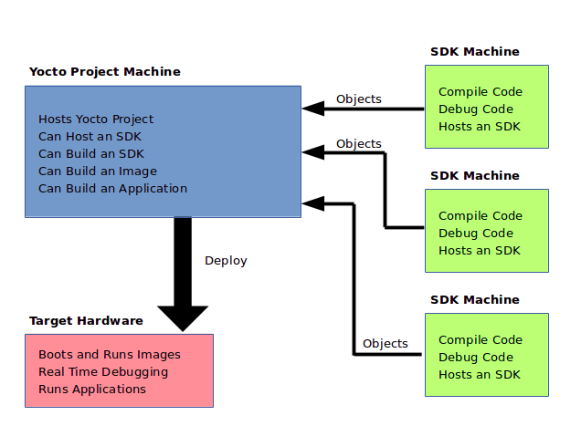

#  Yocto Project Software Development Kit (SDK) Developer's Guide

### Scott Rifenbark

Scotty's Documentation Services, LLC

`<[srifenbark@gmail.com](mailto:srifenbark@gmail.com)>`

Copyright © 2010-2016 Linux Foundation

Permission is granted to copy, distribute and/or modify this document under
the terms of the [Creative Commons Attribution-Share Alike 2.0 UK: England &
Wales](http://creativecommons.org/licenses/by-sa/2.0/uk/) as published by
Creative Commons.

### Note

For the latest version of this manual associated with this Yocto Project
release, see the [Yocto Project Software Development Kit (SDK) Developer's
Guide](http://www.yoctoproject.org/docs/2.2/sdk-manual/sdk-manual.html) from
the Yocto Project website.

**Revision History**

Revision 2.1

April 2016

Released with the Yocto Project 2.1 Release.

Revision 2.2

October 2016

Released with the Yocto Project 2.2 Release.

* * *

**Table of Contents**

1. Introduction

    

1.1. Introduction

    

1.1.1. The Cross-Development Toolchain

1.1.2. Sysroots

1.1.3. The QEMU Emulator

1.1.4. Eclipse Yocto Plug-in

1.1.5. Performance Enhancing Tools

1.2. SDK Development Model

2. Using the Extensible SDK

    

2.1. Why use the Extensible SDK and What is in It?

2.2. Setting Up to Use the Extensible SDK

2.3. Running the Extensible SDK Environment Setup Script

2.4. Using `devtool` in Your SDK Workflow

    

2.4.1. Use `devtool add` to Add an Application

2.4.2. Use `devtool modify` to Modify the Source of an Existing Component

2.4.3. Use `devtool upgrade` to Create a Version of the Recipe that Supports a
Newer Version of the Software

2.5. A Closer Look at `devtool add`

    

2.5.1. Name and Version

2.5.2. Dependency Detection and Mapping

2.5.3. License Detection

2.5.4. Adding Makefile-Only Software

2.5.5. Adding Native Tools

2.5.6. Adding Node.js Modules

2.6. Working With Recipes

    

2.6.1. Finding Logs and Work Files

2.6.2. Setting Configure Arguments

2.6.3. Sharing Files Between Recipes

2.6.4. Packaging

2.7. Restoring the Target Device to its Original State

2.8. Installing Additional Items Into the Extensible SDK

2.9. Updating the Extensible SDK

2.10. Creating a Derivative SDK With Additional Components

3. Using the Standard SDK

    

3.1. Why use the Standard SDK and What is in It?

3.2. Installing the SDK

3.3. Running the SDK Environment Setup Script

4. Using the SDK Toolchain Directly

    

4.1. Autotools-Based Projects

    

4.1.1. Creating and Running a Project Based on GNU Autotools

4.1.2. Passing Host Options

4.2. Makefile-Based Projects

4.3. Developing Applications Using Eclipse™

    

4.3.1. Workflow Using Eclipse™

4.3.2. Working Within Eclipse

A. Obtaining the SDK

    

A.1. Locating Pre-Built SDK Installers

A.2. Building an SDK Installer

A.3. Extracting the Root Filesystem

A.4. Installed Standard SDK Directory Structure

A.5. Installed Extensible SDK Directory Structure

B. Customizing the Extensible SDK

    

B.1. Configuring the Extensible SDK

B.2. Adjusting the Extensible SDK to Suit Your Build System Setup

B.3. Changing the Appearance of the Extensible SDK

B.4. Providing Updates After Installing the Extensible SDK

B.5. Providing Additional Installable Extensible SDK Content

B.6. Minimizing the Size of the Extensible SDK Installer Download

C. Customizing the Standard SDK

    

C.1. Adding Individual Packages to the Standard SDK

C.2. Adding API Documentation to the Standard SDK

D. Using Eclipse Mars

    

D.1. Setting Up the Mars Version of the Eclipse IDE

    

D.1.1. Installing the Mars Eclipse IDE

D.1.2. Configuring the Mars Eclipse IDE

D.1.3. Installing or Accessing the Mars Eclipse Yocto Plug-in

D.1.4. Configuring the Mars Eclipse Yocto Plug-in

D.2. Creating the Project

D.3. Configuring the Cross-Toolchains

D.4. Building the Project

D.5. Starting QEMU in User-Space NFS Mode

D.6. Deploying and Debugging the Application

D.7. Using Linuxtools

## Chapter 1. Introduction¶

**Table of Contents**

1.1. Introduction

    

1.1.1. The Cross-Development Toolchain

1.1.2. Sysroots

1.1.3. The QEMU Emulator

1.1.4. Eclipse Yocto Plug-in

1.1.5. Performance Enhancing Tools

1.2. SDK Development Model

## 1.1. Introduction¶

Welcome to the Yocto Project Software Development Kit (SDK) Developer's Guide.
This manual provides information that explains how to use both the Yocto
Project extensible and standard SDKs to develop applications and images.
Additionally, the manual also provides information on how to use the popular
Eclipse™ IDE as part of your application development workflow within the SDK
environment.

### Note

Prior to the 2.0 Release of the Yocto Project, application development was
primarily accomplished through the use of the Application Development Toolkit
(ADT) and the availability of stand-alone cross-development toolchains and
other tools. With the 2.1 Release of the Yocto Project, application
development has transitioned to within a tool-rich extensible SDK and the more
traditional standard SDK.

All SDKs consist of the following:

  * _Cross-Development Toolchain_: This toolchain contains a compiler, debugger, and various miscellaneous tools. 

  * _Libraries, Headers, and Symbols_: The libraries, headers, and symbols are specific to the image (i.e. they match the image). 

  * _Environment Setup Script_: This `*.sh` file, once run, sets up the cross-development environment by defining variables and preparing for SDK use. 

Additionally an extensible SDK has tools that allow you to easily add new
applications and libraries to an image, modify the source of an existing
component, test changes on the target hardware, and easily integrate an
application into the [OpenEmbedded build
system](http://www.yoctoproject.org/docs/2.2/dev-manual/dev-manual.html#build-
system-term).

You can use an SDK to independently develop and test code that is destined to
run on some target machine. SDKs are completely self-contained. The binaries
are linked against their own copy of `libc`, which results in no dependencies
on the target system. To achieve this, the pointer to the dynamic loader is
configured at install time since that path cannot be dynamically altered. This
is the reason for a wrapper around the `populate_sdk` and `populate_sdk_ext`
archives.

Another feature for the SDKs is that only one set of cross-compiler toolchain
binaries are produced for any given architecture. This feature takes advantage
of the fact that the target hardware can be passed to `gcc` as a set of
compiler options. Those options are set up by the environment script and
contained in variables such as [`CC`](http://www.yoctoproject.org/docs/2.2
/ref-manual/ref-manual.html#var-CC) and
[`LD`](http://www.yoctoproject.org/docs/2.2/ref-manual/ref-manual.html#var-
LD). This reduces the space needed for the tools. Understand, however, that a
sysroot is still needed for every target since those binaries are target-
specific.

The SDK development environment consists of the following:

  * The self-contained SDK, which is an architecture-specific cross-toolchain and matching sysroots (target and native) all built by the OpenEmbedded build system (e.g. the SDK). The toolchain and sysroots are based on a [Metadata](http://www.yoctoproject.org/docs/2.2/dev-manual/dev-manual.html#metadata) configuration and extensions, which allows you to cross-develop on the host machine for the target hardware. Additionally, the extensible SDK contains the `devtool` functionality. 

  * The Quick EMUlator (QEMU), which lets you simulate target hardware. QEMU is not literally part of the SDK. You must build and include this emulator separately. However, QEMU plays an important role in the development process that revolves around use of the SDK. 

  * The Eclipse IDE Yocto Plug-in. This plug-in is available for you if you are an Eclipse user. In the same manner as QEMU, the plug-in is not literally part of the SDK but is rather available for use as part of the development process. 

  * Various performance-related [tools](http://www.eclipse.org/linuxtools/index.php) that can enhance your development experience. These tools are also separate from the actual SDK but can be independently obtained and used in the development process. 

In summary, the extensible and standard SDK share many features. However, the
extensible SDK has powerful development tools to help you more quickly develop
applications. Following is a table that summarizes the primary differences
between the standard and extensible SDK types when considering which to build:

_Feature__Standard SDK__Extensible SDK_

Toolchain

Yes

Yes*

Debugger

Yes

Yes*

Size

100+ MBytes

1+ GBytes (or 300+ MBytes for minimal w/toolchain)

`devtool`

No

Yes

Build Images

No

Yes

Updateable

No

Yes

Managed Sysroot**

No

Yes

Installed Packages

No***

Yes****

Construction

Packages

Shared State

    
    
         * Extensible SDK will contain the toolchain and debugger if [SDK_EXT_TYPE](http://www.yoctoproject.org/docs/2.2/ref-manual/ref-manual.html#var-SDK_EXT_TYPE) is "full" or [SDK_INCLUDE_TOOLCHAIN](http://www.yoctoproject.org/docs/2.2/ref-manual/ref-manual.html#var-SDK_INCLUDE_TOOLCHAIN) is "1", which is the default.
    
         ** Sysroot is managed through use of devtool.  Thus, it is less likely that you will corrupt your SDK sysroot when you try to add additional libraries.
    
         *** Runtime package management can be added to the standard SDK but it is not supported by default.
    
         **** You must build and make the shared state available to extensible SDK users for "packages" you want to enable users to install.
            

### 1.1.1. The Cross-Development Toolchain¶

The [Cross-Development Toolchain](http://www.yoctoproject.org/docs/2.2/dev-
manual/dev-manual.html#cross-development-toolchain) consists of a cross-
compiler, cross-linker, and cross-debugger that are used to develop user-space
applications for targeted hardware. Additionally, for an extensible SDK, the
toolchain also has built-in `devtool` functionality. This toolchain is created
by running a SDK installer script or through a [Build
Directory](http://www.yoctoproject.org/docs/2.2/dev-manual/dev-manual.html
#build-directory) that is based on your Metadata configuration or extension
for your targeted device. The cross-toolchain works with a matching target
sysroot.

### 1.1.2. Sysroots¶

The native and target sysroots contain needed headers and libraries for
generating binaries that run on the target architecture. The target sysroot is
based on the target root filesystem image that is built by the OpenEmbedded
build system and uses the same Metadata configuration used to build the cross-
toolchain.

### 1.1.3. The QEMU Emulator¶

The QEMU emulator allows you to simulate your hardware while running your
application or image. QEMU is not part of the SDK but is made available a
number of ways:

  * If you have cloned the `poky` Git repository to create a [Source Directory](http://www.yoctoproject.org/docs/2.2/dev-manual/dev-manual.html#source-directory) and you have sourced the environment setup script, QEMU is installed and automatically available. 

  * If you have downloaded a Yocto Project release and unpacked it to create a [Source Directory](http://www.yoctoproject.org/docs/2.2/dev-manual/dev-manual.html#source-directory) and you have sourced the environment setup script, QEMU is installed and automatically available. 

  * If you have installed the cross-toolchain tarball and you have sourced the toolchain's setup environment script, QEMU is also installed and automatically available. 

### 1.1.4. Eclipse Yocto Plug-in¶

The Eclipse IDE is a popular development environment and it fully supports
development using the Yocto Project. When you install and configure the
Eclipse Yocto Project Plug-in into the Eclipse IDE, you maximize your Yocto
Project experience. Installing and configuring the Plug-in results in an
environment that has extensions specifically designed to let you more easily
develop software. These extensions allow for cross-compilation, deployment,
and execution of your output into a QEMU emulation session. You can also
perform cross-debugging and profiling. The environment also supports many
performance-related [tools](http://www.eclipse.org/linuxtools/index.php) that
enhance your development experience.

### Note

Previous releases of the Eclipse Yocto Plug-in supported "user-space tools"
(i.e. LatencyTOP, PowerTOP, Perf, SystemTap, and Lttng-ust) that also added to
the development experience. These tools have been deprecated beginning with
this release of the plug-in.

For information about the application development workflow that uses the
Eclipse IDE and for a detailed example of how to install and configure the
Eclipse Yocto Project Plug-in, see the "Developing Applications Using
Eclipse™" section.

### 1.1.5. Performance Enhancing Tools¶

Supported performance enhancing tools are available that let you profile,
debug, and perform tracing on your projects developed using Eclipse. For
information on these tools see
[http://www.eclipse.org/linuxtools/](http://www.eclipse.org/linuxtools/).

## 1.2. SDK Development Model¶

Fundamentally, the SDK fits into the development process as follows:

The SDK is installed on any machine and can be used to develop applications,
images, and kernels. An SDK can even be used by a QA Engineer or Release
Engineer. The fundamental concept is that the machine that has the SDK
installed does not have to be associated with the machine that has the Yocto
Project installed. A developer can independently compile and test an object on
their machine and then, when the object is ready for integration into an
image, they can simply make it available to the machine that has the Yocto
Project. Once the object is available, the image can be rebuilt using the
Yocto Project to produce the modified image.

You just need to follow these general steps:

  1. _Install the SDK for your target hardware:_ For information on how to install the SDK, see the "Installing the SDK" section.

  2. _Download or Build the Target Image:_ The Yocto Project supports several target architectures and has many pre-built kernel images and root filesystem images.

If you are going to develop your application on hardware, go to the [`machines
`](http://downloads.yoctoproject.org/releases/yocto/yocto-2.2/machines)
download area and choose a target machine area from which to download the
kernel image and root filesystem. This download area could have several files
in it that support development using actual hardware. For example, the area
might contain `.hddimg` files that combine the kernel image with the
filesystem, boot loaders, and so forth. Be sure to get the files you need for
your particular development process.

If you are going to develop your application and then run and test it using
the QEMU emulator, go to the [`machines/qemu`](http://downloads.yoctoproject.o
rg/releases/yocto/yocto-2.2/machines/qemu) download area. From this area, go
down into the directory for your target architecture (e.g. `qemux86_64` for an
Intel®-based 64-bit architecture). Download kernel, root filesystem, and any
other files you need for your process.

### Note

To use the root filesystem in QEMU, you need to extract it. See the
"Extracting the Root Filesystem" section for information on how to extract the
root filesystem.

  3. _Develop and Test your Application:_ At this point, you have the tools to develop your application. If you need to separately install and use the QEMU emulator, you can go to [QEMU Home Page](http://wiki.qemu.org/Main_Page) to download and learn about the emulator. See the "[Using the Quick EMUlator (QEMU)](http://www.yoctoproject.org/docs/2.2/dev-manual/dev-manual.html#dev-manual-qemu)" chapter in the Yocto Project Development Manual for information on using QEMU within the Yocto Project.

The remainder of this manual describes how to use both the standard SDK and
the extensible SDK. Information also exists in appendix form that describes
how you can build, install, and modify an SDK.

## Chapter 2. Using the Extensible SDK¶

**Table of Contents**

2.1. Why use the Extensible SDK and What is in It?

2.2. Setting Up to Use the Extensible SDK

2.3. Running the Extensible SDK Environment Setup Script

2.4. Using `devtool` in Your SDK Workflow

    

2.4.1. Use `devtool add` to Add an Application

2.4.2. Use `devtool modify` to Modify the Source of an Existing Component

2.4.3. Use `devtool upgrade` to Create a Version of the Recipe that Supports a
Newer Version of the Software

2.5. A Closer Look at `devtool add`

    

2.5.1. Name and Version

2.5.2. Dependency Detection and Mapping

2.5.3. License Detection

2.5.4. Adding Makefile-Only Software

2.5.5. Adding Native Tools

2.5.6. Adding Node.js Modules

2.6. Working With Recipes

    

2.6.1. Finding Logs and Work Files

2.6.2. Setting Configure Arguments

2.6.3. Sharing Files Between Recipes

2.6.4. Packaging

2.7. Restoring the Target Device to its Original State

2.8. Installing Additional Items Into the Extensible SDK

2.9. Updating the Extensible SDK

2.10. Creating a Derivative SDK With Additional Components

This chapter describes the extensible SDK and how to install it. Information
covers the pieces of the SDK, how to install it, and presents a look at using
the `devtool` functionality. The extensible SDK makes it easy to add new
applications and libraries to an image, modify the source for an existing
component, test changes on the target hardware, and ease integration into the
rest of the [OpenEmbedded build system](http://www.yoctoproject.org/docs/2.2
/dev-manual/dev-manual.html#build-system-term).

### Note

For a side-by-side comparison of main features supported for an extensible SDK
as compared to a standard SDK, see the "Introduction" section.

In addition to the functionality available through `devtool`, you can
alternatively make use of the toolchain directly, for example from Makefile,
Autotools, and Eclipse-based projects. See the "Using the SDK Toolchain
Directly" chapter for more information.

## 2.1. Why use the Extensible SDK and What is in It?¶

The extensible SDK provides a cross-development toolchain and libraries
tailored to the contents of a specific image. You would use the Extensible SDK
if you want a toolchain experience supplemented with the powerful set of
`devtool` commands tailored for the Yocto Project environment.

The installed extensible SDK consists of several files and directories.
Basically, it contains an SDK environment setup script, some configuration
files, an internal build system, and the `devtool` functionality.

## 2.2. Setting Up to Use the Extensible SDK¶

The first thing you need to do is install the SDK on your host development
machine by running the `*.sh` installation script.

You can download a tarball installer, which includes the pre-built toolchain,
the `runqemu` script, the internal build system, `devtool`, and support files
from the appropriate directory under [http://downloads.yoctoproject.org/releas
es/yocto/yocto-2.2/toolchain/](http://downloads.yoctoproject.org/releases/yoct
o/yocto-2.2/toolchain/). Toolchains are available for 32-bit and 64-bit x86
development systems from the `i686` and `x86_64` directories, respectively.
The toolchains the Yocto Project provides are based off the `core-image-sato`
image and contain libraries appropriate for developing against that image.
Each type of development system supports five or more target architectures.

The names of the tarball installer scripts are such that a string representing
the host system appears first in the filename and then is immediately followed
by a string representing the target architecture. An extensible SDK has the
string "-ext" as part of the name.

    
    
         poky-glibc-_host_system_-_image_type_-_arch_-toolchain-ext-_release_version_.sh
    
         Where:
             _host_system_ is a string representing your development system:
    
                        i686 or x86_64.
    
             _image_type_ is the image for which the SDK was built.
    
             _arch_ is a string representing the tuned target architecture:
    
                        i586, x86_64, powerpc, mips, armv7a or armv5te
    
             _release_version_ is a string representing the release number of the
                    Yocto Project:
    
                        2.2, 2.2+snapshot
                

For example, the following SDK installer is for a 64-bit development host
system and a i586-tuned target architecture based off the SDK for `core-image-
sato` and using the current 2.2 snapshot:

    
    
         poky-glibc-x86_64-core-image-sato-i586-toolchain-ext-2.2.sh
                

### Note

As an alternative to downloading an SDK, you can build the SDK installer. For
information on building the installer, see the "Building an SDK Installer"
section. Another helpful resource for building an installer is the [Cookbook
guide to Making an Eclipse Debug Capable Image](https://wiki.yoctoproject.org/
wiki/TipsAndTricks/RunningEclipseAgainstBuiltImage) wiki page. This wiki page
focuses on development when using the Eclipse IDE.

The SDK and toolchains are self-contained and by default are installed into
the `poky_sdk` folder in your home directory. You can choose to install the
extensible SDK in any location when you run the installer. However, the
location you choose needs to be writable for whichever users need to use the
SDK, since files will need to be written under that directory during the
normal course of operation.

The following command shows how to run the installer given a toolchain tarball
for a 64-bit x86 development host system and a 64-bit x86 target architecture.
The example assumes the SDK installer is located in `~/Downloads/`.

### Note

If you do not have write permissions for the directory into which you are
installing the SDK, the installer notifies you and exits. Be sure you have
write permissions in the directory and run the installer again.

    
    
         $ ./poky-glibc-x86_64-core-image-minimal-core2-64-toolchain-ext-2.2.sh
         Poky (Yocto Project Reference Distro) Extensible SDK installer version 2.2
         ===================================================================================
         Enter target directory for SDK (default: ~/poky_sdk):
         You are about to install the SDK to "/home/scottrif/poky_sdk". Proceed[Y/n]? Y
         Extracting SDK......................................................................done
         Setting it up...
         Extracting buildtools...
         Preparing build system...
         done
         SDK has been successfully set up and is ready to be used.
         Each time you wish to use the SDK in a new shell session, you need to source the environment setup script e.g.
          $ . /home/scottrif/poky_sdk/environment-setup-core2-64-poky-linux
                

## 2.3. Running the Extensible SDK Environment Setup Script¶

Once you have the SDK installed, you must run the SDK environment setup script
before you can actually use it. This setup script resides in the directory you
chose when you installed the SDK, which is either the default `poky_sdk`
directory or the directory you chose during installation.

Before running the script, be sure it is the one that matches the architecture
for which you are developing. Environment setup scripts begin with the string
"`environment-setup`" and include as part of their name the tuned target
architecture. As an example, the following commands set the working directory
to where the SDK was installed and then source the environment setup script.
In this example, the setup script is for an IA-based target machine using i586
tuning:

    
    
         $ cd /home/scottrif/poky_sdk
         $ source environment-setup-core2-64-poky-linux
         SDK environment now set up; additionally you may now run devtool to perform development tasks.
         Run devtool --help for further details.
                

When you run the setup script, many environment variables are defined:

    
    
         [SDKTARGETSYSROOT](http://www.yoctoproject.org/docs/2.2/ref-manual/ref-manual.html#var-SDKTARGETSYSROOT) - The path to the sysroot used for cross-compilation
         [PKG_CONFIG_PATH](http://www.yoctoproject.org/docs/2.2/ref-manual/ref-manual.html#var-PKG_CONFIG_PATH) - The path to the target pkg-config files
         [CONFIG_SITE](http://www.yoctoproject.org/docs/2.2/ref-manual/ref-manual.html#var-CONFIG_SITE) - A GNU autoconf site file preconfigured for the target
         [CC](http://www.yoctoproject.org/docs/2.2/ref-manual/ref-manual.html#var-CC) - The minimal command and arguments to run the C compiler
         [CXX](http://www.yoctoproject.org/docs/2.2/ref-manual/ref-manual.html#var-CXX) - The minimal command and arguments to run the C++ compiler
         [CPP](http://www.yoctoproject.org/docs/2.2/ref-manual/ref-manual.html#var-CPP) - The minimal command and arguments to run the C preprocessor
         [AS](http://www.yoctoproject.org/docs/2.2/ref-manual/ref-manual.html#var-AS) - The minimal command and arguments to run the assembler
         [LD](http://www.yoctoproject.org/docs/2.2/ref-manual/ref-manual.html#var-LD) - The minimal command and arguments to run the linker
         [GDB](http://www.yoctoproject.org/docs/2.2/ref-manual/ref-manual.html#var-GDB) - The minimal command and arguments to run the GNU Debugger
         [STRIP](http://www.yoctoproject.org/docs/2.2/ref-manual/ref-manual.html#var-STRIP) - The minimal command and arguments to run 'strip', which strips symbols
         [RANLIB](http://www.yoctoproject.org/docs/2.2/ref-manual/ref-manual.html#var-RANLIB) - The minimal command and arguments to run 'ranlib'
         [OBJCOPY](http://www.yoctoproject.org/docs/2.2/ref-manual/ref-manual.html#var-OBJCOPY) - The minimal command and arguments to run 'objcopy'
         [OBJDUMP](http://www.yoctoproject.org/docs/2.2/ref-manual/ref-manual.html#var-OBJDUMP) - The minimal command and arguments to run 'objdump'
         [AR](http://www.yoctoproject.org/docs/2.2/ref-manual/ref-manual.html#var-AR) - The minimal command and arguments to run 'ar'
         [NM](http://www.yoctoproject.org/docs/2.2/ref-manual/ref-manual.html#var-NM) - The minimal command and arguments to run 'nm'
         [TARGET_PREFIX](http://www.yoctoproject.org/docs/2.2/ref-manual/ref-manual.html#var-TARGET_PREFIX) - The toolchain binary prefix for the target tools
         [CROSS_COMPILE](http://www.yoctoproject.org/docs/2.2/ref-manual/ref-manual.html#var-CROSS_COMPILE) - The toolchain binary prefix for the target tools
         [CONFIGURE_FLAGS](http://www.yoctoproject.org/docs/2.2/ref-manual/ref-manual.html#var-CONFIGURE_FLAGS) - The minimal arguments for GNU configure
         [CFLAGS](http://www.yoctoproject.org/docs/2.2/ref-manual/ref-manual.html#var-CFLAGS) - Suggested C flags
         [CXXFLAGS](http://www.yoctoproject.org/docs/2.2/ref-manual/ref-manual.html#var-CXXFLAGS) - Suggested C++ flags
         [LDFLAGS](http://www.yoctoproject.org/docs/2.2/ref-manual/ref-manual.html#var-LDFLAGS) - Suggested linker flags when you use CC to link
         [CPPFLAGS](http://www.yoctoproject.org/docs/2.2/ref-manual/ref-manual.html#var-CPPFLAGS) - Suggested preprocessor flags
                

## 2.4. Using `devtool` in Your SDK Workflow¶

The cornerstone of the extensible SDK is a command-line tool called `devtool`.
This tool provides a number of features that help you build, test and package
software within the extensible SDK, and optionally integrate it into an image
built by the OpenEmbedded build system.

The `devtool` command line is organized similarly to
[Git](http://www.yoctoproject.org/docs/2.2/dev-manual/dev-manual.html#git) in
that it has a number of sub-commands for each function. You can run `devtool
--help` to see all the commands.

Three `devtool` subcommands that provide entry-points into development are:

  * _`devtool add`_: Assists in adding new software to be built. 

  * _`devtool modify`_: Sets up an environment to enable you to modify the source of an existing component. 

  * _`devtool upgrade`_: Updates an existing recipe so that you can build it for an updated set of source files. 

As with the OpenEmbedded build system, "recipes" represent software packages
within `devtool`. When you use `devtool add`, a recipe is automatically
created. When you use `devtool modify`, the specified existing recipe is used
in order to determine where to get the source code and how to patch it. In
both cases, an environment is set up so that when you build the recipe a
source tree that is under your control is used in order to allow you to make
changes to the source as desired. By default, both new recipes and the source
go into a "workspace" directory under the SDK.

The remainder of this section presents the `devtool add`, `devtool modify`,
and `devtool upgrade` workflows.

### 2.4.1. Use `devtool add` to Add an Application¶

The `devtool add` command generates a new recipe based on existing source
code. This command takes advantage of the
[workspace](http://www.yoctoproject.org/docs/2.2/dev-manual/dev-manual.html
#devtool-the-workspace-layer-structure) layer that many `devtool` commands
use. The command is flexible enough to allow you to extract source code into
both the workspace or a separate local Git repository and to use existing code
that does not need to be extracted.

Depending on your particular scenario, the arguments and options you use with
`devtool add` form different combinations. The following diagram shows common
development flows you would use with the `devtool add` command:

  1. _Generating the New Recipe_: The top part of the flow shows three scenarios by which you could use `devtool add` to generate a recipe based on existing source code.

In a shared development environment, it is typical where other developers are
responsible for various areas of source code. As a developer, you are probably
interested in using that source code as part of your development using the
Yocto Project. All you need is access to the code, a recipe, and a controlled
area in which to do your work.

Within the diagram, three possible scenarios feed into the `devtool add`
workflow:

    * _Left_: The left scenario represents a common situation where the source code does not exist locally and needs to be extracted. In this situation, you just let it get extracted to the default workspace - you do not want it in some specific location outside of the workspace. Thus, everything you need will be located in the workspace: 
    
    
         $ devtool add _recipe fetchuri_
                                    

With this command, `devtool` creates a recipe and an append file in the
workspace as well as extracts the upstream source files into a local Git
repository also within the `sources` folder.

    * _Middle_: The middle scenario also represents a situation where the source code does not exist locally. In this case, the code is again upstream and needs to be extracted to some local area - this time outside of the default workspace. If required, `devtool` always creates a Git repository locally during the extraction. Furthermore, the first positional argument _`srctree`_ in this case identifies where the `devtool add` command will locate the extracted code outside of the workspace: 
    
    
         $ devtool add _recipe srctree fetchuri_
                                    

In summary, the source code is pulled from _`fetchuri`_ and extracted into the
location defined by _`srctree`_ as a local Git repository.

Within workspace, `devtool` creates both the recipe and an append file for the
recipe.

    * _Right_: The right scenario represents a situation where the source tree (srctree) has been previously prepared outside of the `devtool` workspace. 

The following command names the recipe and identifies where the existing
source tree is located:

    
    
         $ devtool add _recipe srctree_
                                    

The command examines the source code and creates a recipe for it placing the
recipe into the workspace.

Because the extracted source code already exists, `devtool` does not try to
relocate it into the workspace - just the new the recipe is placed in the
workspace.

Aside from a recipe folder, the command also creates an append folder and
places an initial `*.bbappend` within.

  2. _Edit the Recipe_: At this point, you can use `devtool edit-recipe` to open up the editor as defined by the `$EDITOR` environment variable and modify the file: 
    
    
         $ devtool edit-recipe _recipe_
                            

From within the editor, you can make modifications to the recipe that take
affect when you build it later.

  3. _Build the Recipe or Rebuild the Image_: At this point in the flow, the next step you take depends on what you are going to do with the new code.

If you need to take the build output and eventually move it to the target
hardware, you would use `devtool build`:

    
    
         $ devtool build _recipe_
                            

On the other hand, if you want an image to contain the recipe's packages for
immediate deployment onto a device (e.g. for testing purposes), you can use
the `devtool build-image` command:

    
    
         $ devtool build-image _image_
                            

  4. _Deploy the Build Output_: When you use the `devtool build` command to build out your recipe, you probably want to see if the resulting build output works as expected on target hardware. 

### Note

This step assumes you have a previously built image that is already either
running in QEMU or running on actual hardware. Also, it is assumed that for
deployment of the image to the target, SSH is installed in the image and if
the image is running on real hardware that you have network access to and from
your development machine.

You can deploy your build output to that target hardware by using the `devtool
deploy-target` command:

    
    
         $ devtool deploy-target _recipe target_
                            

The _`target`_ is a live target machine running as an SSH server.

You can, of course, also deploy the image you build using the `devtool build-
image` command to actual hardware. However, `devtool` does not provide a
specific command that allows you to do this.

  5. _Finish Your Work With the Recipe_: The `devtool finish` command creates any patches corresponding to commits in the local Git repository, moves the new recipe to a more permanent layer, and then resets the recipe so that the recipe is built normally rather than from the workspace. 
    
    
         $ devtool finish _recipe layer_
                            

### Note

Any changes you want to turn into patches must be committed to the Git
repository in the source tree.

As mentioned, the `devtool finish` command moves the final recipe to its
permanent layer.

As a final process of the `devtool finish` command, the state of the standard
layers and the upstream source is restored so that you can build the recipe
from those areas rather than the workspace.

### Note

You can use the `devtool reset` command to put things back should you decide
you do not want to proceed with your work. If you do use this command, realize
that the source tree is preserved.

### 2.4.2. Use `devtool modify` to Modify the Source of an Existing Component¶

The `devtool modify` command prepares the way to work on existing code that
already has a recipe in place. The command is flexible enough to allow you to
extract code, specify the existing recipe, and keep track of and gather any
patch files from other developers that are associated with the code.

Depending on your particular scenario, the arguments and options you use with
`devtool modify` form different combinations. The following diagram shows
common development flows you would use with the `devtool modify` command:

  1. _Preparing to Modify the Code_: The top part of the flow shows three scenarios by which you could use `devtool modify` to prepare to work on source files. Each scenario assumes the following: 

    * The recipe exists in some layer external to the `devtool` workspace. 

    * The source files exist upstream in an un-extracted state or locally in a previously extracted state. 

The typical situation is where another developer has created some layer for
use with the Yocto Project and their recipe already resides in that layer.
Furthermore, their source code is readily available either upstream or
locally.

    * _Left_: The left scenario represents a common situation where the source code does not exist locally and needs to be extracted. In this situation, the source is extracted into the default workspace location. The recipe, in this scenario, is in its own layer outside the workspace (i.e. `meta-`_`layername`_). 

The following command identifies the recipe and by default extracts the source
files:

    
    
         $ devtool modify _recipe_
                                    

Once `devtool`locates the recipe, it uses the
[`SRC_URI`](http://www.yoctoproject.org/docs/2.2/ref-manual/ref-manual.html
#var-SRC_URI) variable to locate the source code and any local patch files
from other developers are located.

### Note

You cannot provide an URL for _`srctree`_ when using the `devtool modify`
command.

With this scenario, however, since no _`srctree`_ argument exists, the
`devtool modify` command by default extracts the source files to a Git
structure. Furthermore, the location for the extracted source is the default
area within the workspace. The result is that the command sets up both the
source code and an append file within the workspace with the recipe remaining
in its original location.

    * _Middle_: The middle scenario represents a situation where the source code also does not exist locally. In this case, the code is again upstream and needs to be extracted to some local area as a Git repository. The recipe, in this scenario, is again in its own layer outside the workspace.

The following command tells `devtool` what recipe with which to work and, in
this case, identifies a local area for the extracted source files that is
outside of the default workspace:

    
    
         $ devtool modify _recipe srctree_
                                    

As with all extractions, the command uses the recipe's `SRC_URI` to locate the
source files. Once the files are located, the command by default extracts
them. Providing the _`srctree`_ argument instructs `devtool` where place the
extracted source.

Within workspace, `devtool` creates an append file for the recipe. The recipe
remains in its original location but the source files are extracted to the
location you provided with _`srctree`_.

    * _Right_: The right scenario represents a situation where the source tree (_`srctree`_) exists as a previously extracted Git structure outside of the `devtool` workspace. In this example, the recipe also exists elsewhere in its own layer. 

The following command tells `devtool` the recipe with which to work, uses the
"-n" option to indicate source does not need to be extracted, and uses
_`srctree`_ to point to the previously extracted source files:

    
    
         $ devtool modify -n _recipe srctree_
                                    

Once the command finishes, it creates only an append file for the recipe in
the workspace. The recipe and the source code remain in their original
locations.

  2. _Edit the Source_: Once you have used the `devtool modify` command, you are free to make changes to the source files. You can use any editor you like to make and save your source code modifications. 

  3. _Build the Recipe_: Once you have updated the source files, you can build the recipe. 

  4. _Deploy the Build Output_: When you use the `devtool build` command to build out your recipe, you probably want to see if the resulting build output works as expected on target hardware. 

### Note

This step assumes you have a previously built image that is already either
running in QEMU or running on actual hardware. Also, it is assumed that for
deployment of the image to the target, SSH is installed in the image and if
the image is running on real hardware that you have network access to and from
your development machine.

You can deploy your build output to that target hardware by using the `devtool
deploy-target` command:

    
    
         $ devtool deploy-target _recipe target_
                            

The _`target`_ is a live target machine running as an SSH server.

You can, of course, also deploy the image you build using the `devtool build-
image` command to actual hardware. However, `devtool` does not provide a
specific command that allows you to do this.

  5. _Finish Your Work With the Recipe_: The `devtool finish` command creates any patches corresponding to commits in the local Git repository, updates the recipe to point to them (or creates a `.bbappend` file to do so, depending on the specified destination layer), and then resets the recipe so that the recipe is built normally rather than from the workspace. 
    
    
         $ devtool finish _recipe layer_
                            

### Note

Any changes you want to turn into patches must be committed to the Git
repository in the source tree.

Because there is no need to move the recipe, `devtool finish` either updates
the original recipe in the original layer or the command creates a `.bbappend`
in a different layer as provided by _`layer`_.

As a final process of the `devtool finish` command, the state of the standard
layers and the upstream source is restored so that you can build the recipe
from those areas rather than the workspace.

### Note

You can use the `devtool reset` command to put things back should you decide
you do not want to proceed with your work. If you do use this command, realize
that the source tree is preserved.

### 2.4.3. Use `devtool upgrade` to Create a Version of the Recipe that
Supports a Newer Version of the Software¶

The `devtool upgrade` command updates an existing recipe so that you can build
it for an updated set of source files. The command is flexible enough to allow
you to specify source code revision and versioning schemes, extract code into
or out of the `devtool` workspace, and work with any source file forms that
the fetchers support.

Depending on your particular scenario, the arguments and options you use with
`devtool upgrade` form different combinations. The following diagram shows a
common development flow you would use with the `devtool modify` command:

  1. _Initiate the Upgrade_: The top part of the flow shows a typical scenario by which you could use `devtool upgrade`. The following conditions exist: 

    * The recipe exists in some layer external to the `devtool` workspace. 

    * The source files for the new release exist adjacent to the same location pointed to by [`SRC_URI`](http://www.yoctoproject.org/docs/2.2/ref-manual/ref-manual.html#var-SRC_URI) in the recipe (e.g. a tarball with the new version number in the name, or as a different revision in the upstream Git repository). 

A common situation is where third-party software has undergone a revision so
that it has been upgraded. The recipe you have access to is likely in your own
layer. Thus, you need to upgrade the recipe to use the newer version of the
software:

    
    
         $ devtool upgrade -V _version recipe_
                            

By default, the `devtool upgrade` command extracts source code into the
`sources` directory in the workspace. If you want the code extracted to any
other location, you need to provide the _`srctree`_ positional argument with
the command as follows:

    
    
         $ devtool upgrade -V _version recipe srctree_
                            

Also, in this example, the "-V" option is used to specify the new version. If
the source files pointed to by the `SRC_URI` statement in the recipe are in a
Git repository, you must provide the "-S" option and specify a revision for
the software.

Once `devtool` locates the recipe, it uses the `SRC_URI` variable to locate
the source code and any local patch files from other developers are located.
The result is that the command sets up the source code, the new version of the
recipe, and an append file all within the workspace.

  2. _Resolve any Conflicts created by the Upgrade_: At this point, there could be some conflicts due to the software being upgraded to a new version. This would occur if your recipe specifies some patch files in `SRC_URI` that conflict with changes made in the new version of the software. If this is the case, you need to resolve the conflicts by editing the source and following the normal `git rebase` conflict resolution process.

Before moving onto the next step, be sure to resolve any such conflicts
created through use of a newer or different version of the software.

  3. _Build the Recipe_: Once you have your recipe in order, you can build it. You can either use `devtool build` or `bitbake`. Either method produces build output that is stored in [`TMPDIR`](http://www.yoctoproject.org/docs/2.2/ref-manual/ref-manual.html#var-TMPDIR). 

  4. _Deploy the Build Output_: When you use the `devtool build` command or `bitbake` to build out your recipe, you probably want to see if the resulting build output works as expected on target hardware. 

### Note

This step assumes you have a previously built image that is already either
running in QEMU or running on actual hardware. Also, it is assumed that for
deployment of the image to the target, SSH is installed in the image and if
the image is running on real hardware that you have network access to and from
your development machine.

You can deploy your build output to that target hardware by using the `devtool
deploy-target` command:

    
    
         $ devtool deploy-target _recipe target_
                            

The _`target`_ is a live target machine running as an SSH server.

You can, of course, also deploy the image you build using the `devtool build-
image` command to actual hardware. However, `devtool` does not provide a
specific command that allows you to do this.

  5. _Finish Your Work With the Recipe_: The `devtool finish` command creates any patches corresponding to commits in the local Git repository, moves the new recipe to a more permanent layer, and then resets the recipe so that the recipe is built normally rather than from the workspace. If you specify a destination layer that is the same as the original source, then the old version of the recipe and associated files will be removed prior to adding the new version. 
    
    
         $ devtool finish _recipe layer_
                            

### Note

Any changes you want to turn into patches must be committed to the Git
repository in the source tree.

As a final process of the `devtool finish` command, the state of the standard
layers and the upstream source is restored so that you can build the recipe
from those areas rather than the workspace.

### Note

You can use the `devtool reset` command to put things back should you decide
you do not want to proceed with your work. If you do use this command, realize
that the source tree is preserved.

## 2.5. A Closer Look at `devtool add`¶

The `devtool add` command automatically creates a recipe based on the source
tree with which you provide it. Currently, the command has support for the
following:

  * Autotools (`autoconf` and `automake`) 

  * CMake 

  * Scons 

  * `qmake`

  * Plain `Makefile`

  * Out-of-tree kernel module 

  * Binary package (i.e. "-b" option) 

  * Node.js module 

  * Python modules that use `setuptools` or `distutils`

Apart from binary packages, the determination of how a source tree should be
treated is automatic based on the files present within that source tree. For
example, if a `CMakeLists.txt` file is found, then the source tree is assumed
to be using CMake and is treated accordingly.

### Note

In most cases, you need to edit the automatically generated recipe in order to
make it build properly. Typically, you would go through several edit and build
cycles until you can build the recipe. Once the recipe can be built, you could
use possible further iterations to test the recipe on the target device.

The remainder of this section covers specifics regarding how parts of the
recipe are generated.

### 2.5.1. Name and Version¶

If you do not specify a name and version on the command line, `devtool add`
attempts to determine the name and version of the software being built from
various metadata within the source tree. Furthermore, the command sets the
name of the created recipe file accordingly. If the name or version cannot be
determined, the `devtool add` command prints an error and you must re-run the
command with both the name and version or just the name or version specified.

Sometimes the name or version determined from the source tree might be
incorrect. For such a case, you must reset the recipe:

    
    
         $ devtool reset -n _recipename_
                    

After running the `devtool reset` command, you need to run `devtool add` again
and provide the name or the version.

### 2.5.2. Dependency Detection and Mapping¶

The `devtool add` command attempts to detect build-time dependencies and map
them to other recipes in the system. During this mapping, the command fills in
the names of those recipes in the
[`DEPENDS`](http://www.yoctoproject.org/docs/2.2/ref-manual/ref-manual.html
#var-DEPENDS) value within the recipe. If a dependency cannot be mapped, then
a comment is placed in the recipe indicating such. The inability to map a
dependency might be caused because the naming is not recognized or because the
dependency simply is not available. For cases where the dependency is not
available, you must use the `devtool add` command to add an additional recipe
to satisfy the dependency and then come back to the first recipe and add its
name to `DEPENDS`.

If you need to add runtime dependencies, you can do so by adding the following
to your recipe:

    
    
         RDEPENDS_${PN} += "dependency1 dependency2 ..."
                    

### Note

The `devtool add` command often cannot distinguish between mandatory and
optional dependencies. Consequently, some of the detected dependencies might
in fact be optional. When in doubt, consult the documentation or the configure
script for the software the recipe is building for further details. In some
cases, you might find you can substitute the dependency for an option to
disable the associated functionality passed to the configure script.

### 2.5.3. License Detection¶

The `devtool add` command attempts to determine if the software you are adding
is able to be distributed under a common open-source license and sets the
[`LICENSE`](http://www.yoctoproject.org/docs/2.2/ref-manual/ref-manual.html
#var-LICENSE) value accordingly. You should double-check this value against
the documentation or source files for the software you are building and update
that `LICENSE` value if necessary.

The `devtool add` command also sets the
[`LIC_FILES_CHKSUM`](http://www.yoctoproject.org/docs/2.2/ref-manual/ref-
manual.html#var-LIC_FILES_CHKSUM) value to point to all files that appear to
be license-related. However, license statements often appear in comments at
the top of source files or within documentation. Consequently, you might need
to amend the `LIC_FILES_CHKSUM` variable to point to one or more of those
comments if present. Setting `LIC_FILES_CHKSUM` is particularly important for
third-party software. The mechanism attempts to ensure correct licensing
should you upgrade the recipe to a newer upstream version in future. Any
change in licensing is detected and you receive an error prompting you to
check the license text again.

If the `devtool add` command cannot determine licensing information, the
`LICENSE` value is set to "CLOSED" and the `LIC_FILES_CHKSUM` value remains
unset. This behavior allows you to continue with development but is unlikely
to be correct in all cases. Consequently, you should check the documentation
or source files for the software you are building to determine the actual
license.

### 2.5.4. Adding Makefile-Only Software¶

The use of `make` by itself is very common in both proprietary and open source
software. Unfortunately, Makefiles are often not written with cross-
compilation in mind. Thus, `devtool add` often cannot do very much to ensure
that these Makefiles build correctly. It is very common, for example, to
explicitly call `gcc` instead of using the
[`CC`](http://www.yoctoproject.org/docs/2.2/ref-manual/ref-manual.html#var-CC)
variable. Usually, in a cross-compilation environment, `gcc` is the compiler
for the build host and the cross-compiler is named something similar to `arm-
poky-linux-gnueabi-gcc` and might require some arguments (e.g. to point to the
associated sysroot for the target machine).

When writing a recipe for Makefile-only software, keep the following in mind:

  * You probably need to patch the Makefile to use variables instead of hardcoding tools within the toolchain such as `gcc` and `g++`. 

  * The environment in which `make` runs is set up with various standard variables for compilation (e.g. `CC`, `CXX`, and so forth) in a similar manner to the environment set up by the SDK's environment setup script. One easy way to see these variables is to run the `devtool build` command on the recipe and then look in `oe-logs/run.do_compile`. Towards the top of this file you will see a list of environment variables that are being set. You can take advantage of these variables within the Makefile. 

  * If the Makefile sets a default for a variable using "=", that default overrides the value set in the environment, which is usually not desirable. In this situation, you can either patch the Makefile so it sets the default using the "?=" operator, or you can alternatively force the value on the `make` command line. To force the value on the command line, add the variable setting to [`EXTRA_OEMAKE`](http://www.yoctoproject.org/docs/2.2/ref-manual/ref-manual.html#var-EXTRA_OEMAKE) or [`PACKAGECONFIG_CONFARGS`](http://www.yoctoproject.org/docs/2.2/ref-manual/ref-manual.html#var-PACKAGECONFIG_CONFARGS) within the recipe. Here is an example using `EXTRA_OEMAKE`: 
    
    
         EXTRA_OEMAKE += "'CC=${CC}' 'CXX=${CXX}'"
                            

In the above example, single quotes are used around the variable settings as
the values are likely to contain spaces because required default options are
passed to the compiler.

  * Hardcoding paths inside Makefiles is often problematic in a cross-compilation environment. This is particularly true because those hardcoded paths often point to locations on the build host and thus will either be read-only or will introduce contamination into the cross-compilation by virtue of being specific to the build host rather than the target. Patching the Makefile to use prefix variables or other path variables is usually the way to handle this. 

  * Sometimes a Makefile runs target-specific commands such as `ldconfig`. For such cases, you might be able to simply apply patches that remove these commands from the Makefile. 

### 2.5.5. Adding Native Tools¶

Often, you need to build additional tools that run on the build host system as
opposed to the target. You should indicate this using one of the following
methods when you run `devtool add`:

  * Specify the name of the recipe such that it ends with "-native". Specifying the name like this produces a recipe that only builds for the build host. 

  * Specify the "‐‐also-native" option with the `devtool add` command. Specifying this option creates a recipe file that still builds for the target but also creates a variant with a "-native" suffix that builds for the build host. 

### Note

If you need to add a tool that is shipped as part of a source tree that builds
code for the target, you can typically accomplish this by building the native
and target parts separately rather than within the same compilation process.
Realize though that with the "‐‐also-native" option, you can add the tool
using just one recipe file.

### 2.5.6. Adding Node.js Modules¶

You can use the `devtool add` command two different ways to add Node.js
modules: 1) Through `npm` and, 2) from a repository or local source.

Use the following form to add Node.js modules through `npm`:

    
    
         $ devtool add "npm://registry.npmjs.org;name=forever;version=0.15.1"
                    

The name and version parameters are mandatory. Lockdown and shrinkwrap files
are generated and pointed to by the recipe in order to freeze the version that
is fetched for the dependencies according to the first time. This also saves
checksums that are verified on future fetches. Together, these behaviors
ensure the reproducibility and integrity of the build.

### Notes

  * You must use quotes around the URL. The `devtool add` does not require the quotes, but the shell considers ";" as a splitter between multiple commands. Thus, without the quotes, `devtool add` does not receive the other parts, which results in several "command not found" errors. 

  * In order to support adding Node.js modules, a `nodejs` recipe must be part of your SDK in order to provide Node.js itself. 

As mentioned earlier, you can also add Node.js modules directly from a
repository or local source tree. To add modules this way, use `devtool add` in
the following form:

    
    
         $ devtool add https://github.com/diversario/node-ssdp
                    

In this example, `devtool` fetches the specified Git repository, detects that
the code is Node.js code, fetches dependencies using `npm`, and sets
[`SRC_URI`](http://www.yoctoproject.org/docs/2.2/ref-manual/ref-manual.html
#var-SRC_URI) accordingly.

## 2.6. Working With Recipes¶

When building a recipe with `devtool build` the typical build progression is
as follows:

  1. Fetch the source 

  2. Unpack the source 

  3. Configure the source 

  4. Compiling the source 

  5. Install the build output 

  6. Package the installed output 

For recipes in the workspace, fetching and unpacking is disabled as the source
tree has already been prepared and is persistent. Each of these build steps is
defined as a function, usually with a "do_" prefix. These functions are
typically shell scripts but can instead be written in Python.

If you look at the contents of a recipe, you will see that the recipe does not
include complete instructions for building the software. Instead, common
functionality is encapsulated in classes inherited with the `inherit`
directive, leaving the recipe to describe just the things that are specific to
the software to be built. A [`base`](http://www.yoctoproject.org/docs/2.2/ref-
manual/ref-manual.html#ref-classes-base) class exists that is implicitly
inherited by all recipes and provides the functionality that most typical
recipes need.

The remainder of this section presents information useful when working with
recipes.

### 2.6.1. Finding Logs and Work Files¶

When you are debugging a recipe that you previously created using `devtool
add` or whose source you are modifying by using the `devtool modify` command,
after the first run of `devtool build`, you will find some symbolic links
created within the source tree: `oe-logs`, which points to the directory in
which log files and run scripts for each build step are created and `oe-
workdir`, which points to the temporary work area for the recipe. You can use
these links to get more information on what is happening at each build step.

These locations under `oe-workdir` are particularly useful:

  * `image/`: Contains all of the files installed at the [`do_install`](http://www.yoctoproject.org/docs/2.2/ref-manual/ref-manual.html#ref-tasks-install) stage. Within a recipe, this directory is referred to by the expression `${`[`D`](http://www.yoctoproject.org/docs/2.2/ref-manual/ref-manual.html#var-D)`}`. 

  * `sysroot-destdir/`: Contains a subset of files installed within `do_install` that have been put into the shared sysroot. For more information, see the "Sharing Files Between Recipes" section. 

  * `packages-split/`: Contains subdirectories for each package produced by the recipe. For more information, see the "Packaging" section. 

### 2.6.2. Setting Configure Arguments¶

If the software your recipe is building uses GNU autoconf, then a fixed set of
arguments is passed to it to enable cross-compilation plus any extras
specified by [`EXTRA_OECONF`](http://www.yoctoproject.org/docs/2.2/ref-manual
/ref-manual.html#var-EXTRA_OECONF) or
[`PACKAGECONFIG_CONFARGS`](http://www.yoctoproject.org/docs/2.2/ref-manual
/ref-manual.html#var-PACKAGECONFIG_CONFARGS) set within the recipe. If you
wish to pass additional options, add them to `EXTRA_OECONF` or
`PACKAGECONFIG_CONFARGS`. Other supported build tools have similar variables
(e.g. [`EXTRA_OECMAKE`](http://www.yoctoproject.org/docs/2.2/ref-manual/ref-
manual.html#var-EXTRA_OECMAKE) for CMake,
[`EXTRA_OESCONS`](http://www.yoctoproject.org/docs/2.2/ref-manual/ref-
manual.html#var-EXTRA_OESCONS) for Scons, and so forth). If you need to pass
anything on the `make` command line, you can use `EXTRA_OEMAKE` or the
[`PACKAGECONFIG_CONFARGS`](http://www.yoctoproject.org/docs/2.2/ref-manual
/ref-manual.html#var-PACKAGECONFIG_CONFARGS) variables to do so.

You can use the `devtool configure-help` command to help you set the arguments
listed in the previous paragraph. The command determines the exact options
being passed, and shows them to you along with any custom arguments specified
through `EXTRA_OECONF` or `PACKAGECONFIG_CONFARGS`. If applicable, the command
also shows you the output of the configure script's "‐‐help" option as a
reference.

### 2.6.3. Sharing Files Between Recipes¶

Recipes often need to use files provided by other recipes on the build host.
For example, an application linking to a common library needs access to the
library itself and its associated headers. The way this access is accomplished
within the extensible SDK is through the sysroot. One sysroot exists per
"machine" for which the SDK is being built. In practical terms, this means a
sysroot exists for the target machine, and a sysroot exists for the build
host.

Recipes should never write files directly into the sysroot. Instead, files
should be installed into standard locations during the
[`do_install`](http://www.yoctoproject.org/docs/2.2/ref-manual/ref-manual.html
#ref-tasks-install) task within the
`${`[`D`](http://www.yoctoproject.org/docs/2.2/ref-manual/ref-
manual.html#var-D)`}` directory. A subset of these files automatically go into
the sysroot. The reason for this limitation is that almost all files that go
into the sysroot are cataloged in manifests in order to ensure they can be
removed later when a recipe is modified or removed. Thus, the sysroot is able
to remain free from stale files.

### 2.6.4. Packaging¶

Packaging is not always particularly relevant within the extensible SDK.
However, if you examine how build output gets into the final image on the
target device, it is important to understand packaging because the contents of
the image are expressed in terms of packages and not recipes.

During the [`do_package`](http://www.yoctoproject.org/docs/2.2/ref-manual/ref-
manual.html#ref-tasks-package) task, files installed during the
[`do_install`](http://www.yoctoproject.org/docs/2.2/ref-manual/ref-manual.html
#ref-tasks-install) task are split into one main package, which is almost
always named the same as the recipe, and several other packages. This
separation is done because not all of those installed files are always useful
in every image. For example, you probably do not need any of the documentation
installed in a production image. Consequently, for each recipe the
documentation files are separated into a `-doc` package. Recipes that package
software that has optional modules or plugins might do additional package
splitting as well.

After building a recipe you can see where files have gone by looking in the
`oe-workdir/packages-split` directory, which contains a subdirectory for each
package. Apart from some advanced cases, the
[`PACKAGES`](http://www.yoctoproject.org/docs/2.2/ref-manual/ref-manual.html
#var-PACKAGES) and [`FILES`](http://www.yoctoproject.org/docs/2.2/ref-manual
/ref-manual.html#var-FILES) variables controls splitting. The `PACKAGES`
variable lists all of the packages to be produced, while the `FILES` variable
specifies which files to include in each package, using an override to specify
the package. For example, `FILES_${PN}` specifies the files to go into the
main package (i.e. the main package is named the same as the recipe and
`${`[`PN`](http://www.yoctoproject.org/docs/2.2/ref-manual/ref-manual.html
#var-PN)`}` evaluates to the recipe name). The order of the `PACKAGES` value
is significant. For each installed file, the first package whose `FILES` value
matches the file is the package into which the file goes. Defaults exist for
both the `PACKAGES` and `FILES` variables. Consequently, you might find you do
not even need to set these variables in your recipe unless the software the
recipe is building installs files into non-standard locations.

## 2.7. Restoring the Target Device to its Original State¶

If you use the `devtool deploy-target` command to write a recipe's build
output to the target, and you are working on an existing component of the
system, then you might find yourself in a situation where you need to restore
the original files that existed prior to running the `devtool deploy-target`
command. Because the `devtool deploy-target` command backs up any files it
overwrites, you can use the `devtool undeploy-target` to restore those files
and remove any other files the recipe deployed. Consider the following
example:

    
    
         $ devtool undeploy-target lighttpd root@192.168.7.2
                

If you have deployed multiple applications, you can remove them all at once
thus restoring the target device back to its original state:

    
    
         $ devtool undeploy-target -a root@192.168.7.2
                

Information about files deployed to the target as well as any backed up files
are stored on the target itself. This storage of course requires some
additional space on the target machine.

### Note

The `devtool deploy-target` and `devtool undeploy-target` command do not
currently interact with any package management system on the target device
(e.g. RPM or OPKG). Consequently, you should not intermingle operations
`devtool deploy-target` and the package manager operations on the target
device. Doing so could result in a conflicting set of files.

## 2.8. Installing Additional Items Into the Extensible SDK¶

The extensible SDK typically only comes with a small number of tools and
libraries out of the box. If you have a minimal SDK, then it starts mostly
empty and is populated on-demand. However, sometimes you will need to
explicitly install extra items into the SDK. If you need these extra items,
you can first search for the items using the `devtool search` command. For
example, suppose you need to link to libGL but you are not sure which recipe
provides it. You can use the following command to find out:

    
    
         $ devtool search libGL
         mesa                  A free implementation of the OpenGL API
                

Once you know the recipe (i.e. `mesa` in this example), you can install it:

    
    
         $ devtool sdk-install mesa
                

By default, the `devtool sdk-install` assumes the item is available in pre-
built form from your SDK provider. If the item is not available and it is
acceptable to build the item from source, you can add the "-s" option as
follows:

    
    
         $ devtool sdk-install -s mesa
                

It is important to remember that building the item from source takes
significantly longer than installing the pre-built artifact. Also, if no
recipe exists for the item you want to add to the SDK, you must instead add it
using the `devtool add` command.

## 2.9. Updating the Extensible SDK¶

If you are working with an extensible SDK that gets occasionally updated (e.g.
typically when that SDK has been provided to you by another party), then you
will need to manually pull down those updates to your installed SDK.

To update your installed SDK, run the following:

    
    
         $ devtool sdk-update
                

The previous command assumes your SDK provider has set the default update URL
for you. If that URL has not been set, you need to specify it yourself as
follows:

    
    
         $ devtool sdk-update _path_to_update_directory_
                

### Note

The URL needs to point specifically to a published SDK and not an SDK
installer that you would download and install.

## 2.10. Creating a Derivative SDK With Additional Components¶

You might need to produce an SDK that contains your own custom libraries for
sending to a third party (e.g., if you are a vendor with customers needing to
build their own software for the target platform). If that is the case, then
you can produce a derivative SDK based on the currently installed SDK fairly
easily. Use these steps:

  1. If necessary, install an extensible SDK that you want to use as a base for your derivative SDK. 

  2. Source the environment script for the SDK. 

  3. Add the extra libraries or other components you want by using the `devtool add` command. 

  4. Run the `devtool build-sdk` command. 

The above procedure takes the recipes added to the workspace and constructs a
new SDK installer containing those recipes and the resulting binary artifacts.
The recipes go into their own separate layer in the constructed derivative
SDK, leaving the workspace clean and ready for users to add their own recipes.

## Chapter 3. Using the Standard SDK¶

**Table of Contents**

3.1. Why use the Standard SDK and What is in It?

3.2. Installing the SDK

3.3. Running the SDK Environment Setup Script

This chapter describes the standard SDK and how to install it. Information
includes unique installation and setup aspects for the standard SDK.

### Note

For a side-by-side comparison of main features supported for a standard SDK as
compared to an extensible SDK, see the "Introduction" section.

You can use a standard SDK to work on Makefile, Autotools, and Eclipse-based
projects. See the "Working with Different Types of Projects" chapter for more
information.

## 3.1. Why use the Standard SDK and What is in It?¶

The Standard SDK provides a cross-development toolchain and libraries tailored
to the contents of a specific image. You would use the Standard SDK if you
want a more traditional toolchain experience as compared to the extensible
SDK, which provides an internal build system and the `devtool` functionality.

The installed Standard SDK consists of several files and directories.
Basically, it contains an SDK environment setup script, some configuration
files, and host and target root filesystems to support usage. You can see the
directory structure in the "Installed Standard SDK Directory Structure"
section.

## 3.2. Installing the SDK¶

The first thing you need to do is install the SDK on your host development
machine by running the `*.sh` installation script.

You can download a tarball installer, which includes the pre-built toolchain,
the `runqemu` script, and support files from the appropriate directory under [
http://downloads.yoctoproject.org/releases/yocto/yocto-2.2/toolchain/](http://
downloads.yoctoproject.org/releases/yocto/yocto-2.2/toolchain/). Toolchains
are available for 32-bit and 64-bit x86 development systems from the `i686`
and `x86_64` directories, respectively. The toolchains the Yocto Project
provides are based off the `core-image-sato` image and contain libraries
appropriate for developing against that image. Each type of development system
supports five or more target architectures.

The names of the tarball installer scripts are such that a string representing
the host system appears first in the filename and then is immediately followed
by a string representing the target architecture.

    
    
         poky-glibc-_host_system_-_image_type_-_arch_-toolchain-_release_version_.sh
    
         Where:
             _host_system_ is a string representing your development system:
    
                        i686 or x86_64.
    
             _image_type_ is the image for which the SDK was built.
    
             _arch_ is a string representing the tuned target architecture:
    
                        i586, x86_64, powerpc, mips, armv7a or armv5te
    
             _release_version_ is a string representing the release number of the
                    Yocto Project:
    
                        2.2, 2.2+snapshot
                

For example, the following SDK installer is for a 64-bit development host
system and a i586-tuned target architecture based off the SDK for `core-image-
sato` and using the current 2.2 snapshot:

    
    
         poky-glibc-x86_64-core-image-sato-i586-toolchain-2.2.sh
                

### Note

As an alternative to downloading an SDK, you can build the SDK installer. For
information on building the installer, see the "Building an SDK Installer"
section. Another helpful resource for building an installer is the [Cookbook
guide to Making an Eclipse Debug Capable Image](https://wiki.yoctoproject.org/
wiki/TipsAndTricks/RunningEclipseAgainstBuiltImage) wiki page. This wiki page
focuses on development when using the Eclipse IDE.

The SDK and toolchains are self-contained and by default are installed into
`/opt/poky`. However, when you run the SDK installer, you can choose an
installation directory.

### Note

You must change the permissions on the SDK installer script so that it is
executable:

    
    
         $ chmod +x poky-glibc-x86_64-core-image-sato-i586-toolchain-2.2.sh
                    

The following command shows how to run the installer given a toolchain tarball
for a 64-bit x86 development host system and a 32-bit x86 target architecture.
The example assumes the SDK installer is located in `~/Downloads/`.

### Note

If you do not have write permissions for the directory into which you are
installing the SDK, the installer notifies you and exits. Be sure you have
write permissions in the directory and run the installer again.

    
    
         $ ./poky-glibc-x86_64-core-image-sato-i586-toolchain-2.2.sh
         Poky (Yocto Project Reference Distro) SDK installer version 2.2
         ===============================================================
         Enter target directory for SDK (default: /opt/poky/2.2):
         You are about to install the SDK to "/opt/poky/2.2". Proceed[Y/n]? Y
         Extracting SDK.......................................................................done
         Setting it up...done
         SDK has been successfully set up and is ready to be used.
         Each time you wish to use the SDK in a new shell session, you need to source the environment setup script e.g.
          $ . /opt/poky/2.2/environment-setup-i586-poky-linux
                

Again, reference the "Installed Standard SDK Directory Structure" section for
more details on the resulting directory structure of the installed SDK.

## 3.3. Running the SDK Environment Setup Script¶

Once you have the SDK installed, you must run the SDK environment setup script
before you can actually use it. This setup script resides in the directory you
chose when you installed the SDK. For information on where this setup script
can reside, see the "Obtaining the SDK" Appendix.

Before running the script, be sure it is the one that matches the architecture
for which you are developing. Environment setup scripts begin with the string
"`environment-setup`" and include as part of their name the tuned target
architecture. For example, the command to source a setup script for an IA-
based target machine using i586 tuning and located in the default SDK
installation directory is as follows:

    
    
         $ source /opt/poky/2.2/environment-setup-i586-poky-linux
                

When you run the setup script, the same environment variables are defined as
are when you run the setup script for an extensible SDK. See the "Running the
Extensible SDK Environment Setup Script" section for more information.

## Chapter 4. Using the SDK Toolchain Directly¶

**Table of Contents**

4.1. Autotools-Based Projects

    

4.1.1. Creating and Running a Project Based on GNU Autotools

4.1.2. Passing Host Options

4.2. Makefile-Based Projects

4.3. Developing Applications Using Eclipse™

    

4.3.1. Workflow Using Eclipse™

4.3.2. Working Within Eclipse

You can use the SDK toolchain directly with Makefile, Autotools, and Eclipse™
based projects. This chapter covers information specific to each of these
types of projects.

## 4.1. Autotools-Based Projects¶

Once you have a suitable cross-toolchain installed, it is very easy to develop
a project outside of the OpenEmbedded build system. This section presents a
simple "Helloworld" example that shows how to set up, compile, and run the
project.

### 4.1.1. Creating and Running a Project Based on GNU Autotools¶

Follow these steps to create a simple Autotools-based project:

  1. _Create your directory:_ Create a clean directory for your project and then make that directory your working location: 
    
    
         $ mkdir $HOME/helloworld
         $ cd $HOME/helloworld
                            

  2. _Populate the directory:_ Create `hello.c`, `Makefile.am`, and `configure.ac` files as follows: 

    * For `hello.c`, include these lines: 
    
    
         #include <stdio.h>
    
         main()
            {
               printf("Hello World!\n");
            }
                                    

    * For `Makefile.am`, include these lines: 
    
    
         bin_PROGRAMS = hello
         hello_SOURCES = hello.c
                                    

    * For `configure.in`, include these lines: 
    
    
         AC_INIT(hello,0.1)
         AM_INIT_AUTOMAKE([foreign])
         AC_PROG_CC
         AC_PROG_INSTALL
         AC_OUTPUT(Makefile)
                                    

  3. _Source the cross-toolchain environment setup file:_ As described earlier in the manual, installing the cross-toolchain creates a cross-toolchain environment setup script in the directory that the SDK was installed. Before you can use the tools to develop your project, you must source this setup script. The script begins with the string "environment-setup" and contains the machine architecture, which is followed by the string "poky-linux". Here is an example that sources a script from the default SDK installation directory that uses the 32-bit Intel x86 Architecture and the Morty Yocto Project release: 
    
    
         $ source /opt/poky/2.2/environment-setup-i586-poky-linux
                            

  4. _Generate the local aclocal.m4 files and create the configure script:_ The following GNU Autotools generate the local `aclocal.m4` files and create the configure script: 
    
    
         $ aclocal
         $ autoconf
                            

  5. _Generate files needed by GNU coding standards:_ GNU coding standards require certain files in order for the project to be compliant. This command creates those files: 
    
    
         $ touch NEWS README AUTHORS ChangeLog
                            

  6. _Generate the configure file:_ This command generates the `configure`: 
    
    
         $ automake -a
                            

  7. _Cross-compile the project:_ This command compiles the project using the cross-compiler. The [`CONFIGURE_FLAGS`](http://www.yoctoproject.org/docs/2.2/ref-manual/ref-manual.html#var-CONFIGURE_FLAGS) environment variable provides the minimal arguments for GNU configure: 
    
    
         $ ./configure ${CONFIGURE_FLAGS}
                            

  8. _Make and install the project:_ These two commands generate and install the project into the destination directory: 
    
    
         $ make
         $ make install DESTDIR=./tmp
                            

  9. _Verify the installation:_ This command is a simple way to verify the installation of your project. Running the command prints the architecture on which the binary file can run. This architecture should be the same architecture that the installed cross-toolchain supports. 
    
    
         $ file ./tmp/usr/local/bin/hello
                            

  10. _Execute your project:_ To execute the project in the shell, simply enter the name. You could also copy the binary to the actual target hardware and run the project there as well: 
    
    
         $ ./hello
                            

As expected, the project displays the "Hello World!" message.

### 4.1.2. Passing Host Options¶

For an Autotools-based project, you can use the cross-toolchain by just
passing the appropriate host option to `configure.sh`. The host option you use
is derived from the name of the environment setup script found in the
directory in which you installed the cross-toolchain. For example, the host
option for an ARM-based target that uses the GNU EABI is `armv5te-poky-linux-
gnueabi`. You will notice that the name of the script is `environment-setup-
armv5te-poky-linux-gnueabi`. Thus, the following command works to update your
project and rebuild it using the appropriate cross-toolchain tools:

    
    
         $ ./configure --host=armv5te-poky-linux-gnueabi \
            --with-libtool-sysroot=_sysroot_dir_
                    

### Note

If the `configure` script results in problems recognizing the `--with-libtool-
sysroot=`_`sysroot-dir`_ option, regenerate the script to enable the support
by doing the following and then run the script again:

    
    
         $ libtoolize --automake
         $ aclocal -I ${OECORE_TARGET_SYSROOT}/usr/share/aclocal [-I _dir_containing_your_project-specific_m4_macros_]
         $ autoconf
         $ autoheader
         $ automake -a
                        

## 4.2. Makefile-Based Projects¶

For Makefile-based projects, the cross-toolchain environment variables
established by running the cross-toolchain environment setup script are
subject to general `make` rules.

To illustrate this, consider the following four cross-toolchain environment
variables:

    
    
         [CC](http://www.yoctoproject.org/docs/2.2/ref-manual/ref-manual.html#var-CC)=i586-poky-linux-gcc -m32 -march=i586 --sysroot=/opt/poky/2.2/sysroots/i586-poky-linux
         [LD](http://www.yoctoproject.org/docs/2.2/ref-manual/ref-manual.html#var-LD)=i586-poky-linux-ld --sysroot=/opt/poky/2.2/sysroots/i586-poky-linux
         [CFLAGS](http://www.yoctoproject.org/docs/2.2/ref-manual/ref-manual.html#var-CFLAGS)=-O2 -pipe -g -feliminate-unused-debug-types
         [CXXFLAGS](http://www.yoctoproject.org/docs/2.2/ref-manual/ref-manual.html#var-CXXFLAGS)=-O2 -pipe -g -feliminate-unused-debug-types
                

Now, consider the following three cases:

  * _Case 1 - No Variables Set in the `Makefile`:_ Because these variables are not specifically set in the `Makefile`, the variables retain their values based on the environment. 

  * _Case 2 - Variables Set in the `Makefile`:_ Specifically setting variables in the `Makefile` during the build results in the environment settings of the variables being overwritten. 

  * _Case 3 - Variables Set when the `Makefile` is Executed from the Command Line:_ Executing the `Makefile` from the command-line results in the variables being overwritten with command-line content regardless of what is being set in the `Makefile`. In this case, environment variables are not considered unless you use the "-e" flag during the build: 
    
    
         $ make -e _file_
                        

If you use this flag, then the environment values of the variables override
any variables specifically set in the `Makefile`.

### Note

For the list of variables set up by the cross-toolchain environment setup
script, see the "Running the SDK Environment Setup Script" section.

## 4.3. Developing Applications Using Eclipse™¶

If you are familiar with the popular Eclipse IDE, you can use an Eclipse Yocto
Plug-in to allow you to develop, deploy, and test your application all from
within Eclipse. This section describes general workflow using the SDK and
Eclipse and how to configure and set up Eclipse.

### 4.3.1. Workflow Using Eclipse™¶

The following figure and supporting list summarize the application development
general workflow that employs both the SDK Eclipse.

  1. _Prepare the host system for the Yocto Project_: See "[Supported Linux Distributions](http://www.yoctoproject.org/docs/2.2/ref-manual/ref-manual.html#detailed-supported-distros)" and "[Required Packages for the Host Development System](http://www.yoctoproject.org/docs/2.2/ref-manual/ref-manual.html#required-packages-for-the-host-development-system)" sections both in the Yocto Project Reference Manual for requirements. In particular, be sure your host system has the `xterm` package installed. 

  2. _Secure the Yocto Project kernel target image_: You must have a target kernel image that has been built using the OpenEmbedded build system.

Depending on whether the Yocto Project has a pre-built image that matches your
target architecture and where you are going to run the image while you develop
your application (QEMU or real hardware), the area from which you get the
image differs.

    * Download the image from [`machines`](http://downloads.yoctoproject.org/releases/yocto/yocto-2.2/machines) if your target architecture is supported and you are going to develop and test your application on actual hardware. 

    * Download the image from [ `machines/qemu`](http://downloads.yoctoproject.org/releases/yocto/yocto-2.2/machines/qemu) if your target architecture is supported and you are going to develop and test your application using the QEMU emulator. 

    * Build your image if you cannot find a pre-built image that matches your target architecture. If your target architecture is similar to a supported architecture, you can modify the kernel image before you build it. See the "[Patching the Kernel](http://www.yoctoproject.org/docs/2.2/dev-manual/dev-manual.html#patching-the-kernel)" section in the Yocto Project Development manual for an example. 

  3. _Install the SDK_: The SDK provides a target-specific cross-development toolchain, the root filesystem, the QEMU emulator, and other tools that can help you develop your application. For information on how to install the SDK, see the "Installing the SDK" section. 

  4. _Secure the target root filesystem and the Cross-development toolchain_: You need to find and download the appropriate root filesystem and the cross-development toolchain.

You can find the tarballs for the root filesystem in the same area used for
the kernel image. Depending on the type of image you are running, the root
filesystem you need differs. For example, if you are developing an application
that runs on an image that supports Sato, you need to get a root filesystem
that supports Sato.

You can find the cross-development toolchains at [`toolchains`](http://downloa
ds.yoctoproject.org/releases/yocto/yocto-2.2/toolchain/). Be sure to get the
correct toolchain for your development host and your target architecture. See
the "Locating Pre-Built SDK Installers" section for information and the
"Installing the SDK" section for installation information.

### Note

As an alternative to downloading an SDK, you can build the SDK installer. For
information on building the installer, see the "Building an SDK Installer"
section. Another helpful resource for building an installer is the [Cookbook
guide to Making an Eclipse Debug Capable Image](https://wiki.yoctoproject.org/
wiki/TipsAndTricks/RunningEclipseAgainstBuiltImage) wiki page.

  5. _Create and build your application_: At this point, you need to have source files for your application. Once you have the files, you can use the Eclipse IDE to import them and build the project. If you are not using Eclipse, you need to use the cross-development tools you have installed to create the image.

  6. _Deploy the image with the application_: Using the Eclipse IDE, you can deploy your image to the hardware or to QEMU through the project's preferences. You can also use Eclipse to load and test your image under QEMU. See the "[Using the Quick EMUlator (QEMU)](http://www.yoctoproject.org/docs/2.2/dev-manual/dev-manual.html#dev-manual-qemu)" chapter in the Yocto Project Development Manual for information on using QEMU. 

  7. _Test and debug the application_: Once your application is deployed, you need to test it. Within the Eclipse IDE, you can use the debugging environment along with supported performance enhancing [Linux Tools](http://www.eclipse.org/linuxtools/). 

### 4.3.2. Working Within Eclipse¶

The Eclipse IDE is a popular development environment and it fully supports
development using the Yocto Project.

When you install and configure the Eclipse Yocto Project Plug-in into the
Eclipse IDE, you maximize your Yocto Project experience. Installing and
configuring the Plug-in results in an environment that has extensions
specifically designed to let you more easily develop software. These
extensions allow for cross-compilation, deployment, and execution of your
output into a QEMU emulation session as well as actual target hardware. You
can also perform cross-debugging and profiling. The environment also supports
performance enhancing [tools](http://www.eclipse.org/linuxtools/) that allow
you to perform remote profiling, tracing, collection of power data, collection
of latency data, and collection of performance data.

### Note

This release of the Yocto Project supports both the Neon and Mars versions of
the Eclipse IDE. This section provides information on how to use the Neon
release with the Yocto Project. For information on how to use the Mars version
of Eclipse with the Yocto Project, see "Appendix C.

#### 4.3.2.1. Setting Up the Neon Version of the Eclipse IDE¶

To develop within the Eclipse IDE, you need to do the following:

  1. Install the Neon version of the Eclipse IDE. 

  2. Configure the Eclipse IDE. 

  3. Install the Eclipse Yocto Plug-in. 

  4. Configure the Eclipse Yocto Plug-in. 

### Note

Do not install Eclipse from your distribution's package repository. Be sure to
install Eclipse from the official Eclipse download site as directed in the
next section.

##### 4.3.2.1.1. Installing the Neon Eclipse IDE¶

Follow these steps to locate, install, and configure Neon Eclipse:

  1. _Locate the Neon Download:_ Open a browser and go to [http://www.eclipse.org/neon/](http://www.eclipse.org/mars/). 

  2. _Download the Tarball:_ Click through the "Download" buttons to download the file. 

  3. _Unpack the Tarball:_ Move to a clean directory and unpack the tarball. Here is an example: 
    
    
         $ cd ~
         $ tar -xzvf ~/Downloads/eclipse-inst-linux64.tar.gz
                                    

Everything unpacks into a folder named "eclipse-installer".

  4. _Launch the Installer:_ Use the following commands to launch the installer: 
    
    
         $ cd ~/eclipse-installer
         $ ./eclipse-inst
                                    

  5. _Select Your IDE:_ From the list, select the "Eclipse IDE for C/C++ Developers". 

  6. _Install the Software:_ Accept the default "cpp-neon" directory and click "Install". Accept any license agreements and approve any certificates. 

  7. _Launch Neon:_ Click the "Launch" button and accept the default "workspace". 

##### 4.3.2.1.2. Configuring the Neon Eclipse IDE¶

Follow these steps to configure the Neon Eclipse IDE.

### Note

Depending on how you installed Eclipse and what you have already done, some of
the options will not appear. If you cannot find an option as directed by the
manual, it has already been installed.

  1. Be sure Eclipse is running and you are in your workbench. 

  2. Select "Install New Software" from the "Help" pull-down menu. 

  3. Select "Neon - http://download.eclipse.org/releases/neon" from the "Work with:" pull-down menu. 

  4. Expand the box next to "Linux Tools" and select the following: 
    
    
         C/C++ Remote (Over TCF/TE) Run/Debug Launcher
         TM Terminal
                                    

  5. Expand the box next to "Mobile and Device Development" and select the following boxes: 
    
    
         C/C++ Remote (Over TCF/TE) Run/Debug Launcher
         Remote System Explorer User Actions
         TM Terminal
         TCF Remote System Explorer add-in
         TCF Target Explorer
                                    

  6. Expand the box next to "Programming Languages" and select the following box: 
    
    
         C/C++ Development Tools SDK
                                    

  7. Complete the installation by clicking through appropriate "Next" and "Finish" buttons. 

##### 4.3.2.1.3. Installing or Accessing the Neon Eclipse Yocto Plug-in¶

You can install the Eclipse Yocto Plug-in into the Eclipse IDE one of two
ways: use the Yocto Project's Eclipse Update site to install the pre-built
plug-in or build and install the plug-in from the latest source code.

###### 4.3.2.1.3.1. Installing the Pre-built Plug-in from the Yocto Project
Eclipse Update Site¶

To install the Neon Eclipse Yocto Plug-in from the update site, follow these
steps:

  1. Start up the Eclipse IDE. 

  2. In Eclipse, select "Install New Software" from the "Help" menu. 

  3. Click "Add..." in the "Work with:" area. 

  4. Enter `http://downloads.yoctoproject.org/releases/eclipse-plugin/2.2/neon` in the URL field and provide a meaningful name in the "Name" field. 

  5. Click "OK" to have the entry added to the "Work with:" drop-down list. 

  6. Select the entry for the plug-in from the "Work with:" drop-down list. 

  7. Check the boxes next to the following: 
    
    
         Yocto Project SDK Plug-in
         Yocto Project Documentation plug-in
                                        

  8. Complete the remaining software installation steps and then restart the Eclipse IDE to finish the installation of the plug-in. 

### Note

You can click "OK" when prompted about installing software that contains
unsigned content.

###### 4.3.2.1.3.2. Installing the Plug-in Using the Latest Source Code¶

To install the Neon Eclipse Yocto Plug-in from the latest source code, follow
these steps:

  1. Be sure your development system has JDK 1.8+ 

  2. Install X11-related packages: 
    
    
         $ sudo apt-get install xauth
                                        

  3. In a new terminal shell, create a Git repository with: 
    
    
         $ cd ~
         $ git clone git://git.yoctoproject.org/eclipse-poky
                                        

  4. Use Git to create the correct tag: 
    
    
         $ cd ~/eclipse-poky
         $ git checkout neon/yocto-2.2
                                        

This creates a local tag named `neon/yocto-2.2` based on the branch `origin
/neon-master`. You are put into a detached HEAD state, which is fine since you
are only going to be building and not developing.

  5. Change to the `scripts` directory within the Git repository: 
    
    
         $ cd scripts
                                        

  6. Set up the local build environment by running the setup script: 
    
    
         $ ./setup.sh
                                        

When the script finishes execution, it prompts you with instructions on how to
run the `build.sh` script, which is also in the `scripts` directory of the Git
repository created earlier.

  7. Run the `build.sh` script as directed. Be sure to provide the tag name, documentation branch, and a release name. 

Following is an example:

    
    
         $ ECLIPSE_HOME=/home/scottrif/eclipse-poky/scripts/eclipse ./build.sh -l neon/yocto-2.2 master yocto-2.2 2>&1 | tee build.log
                                        

The previous example command adds the tag you need for `mars/yocto-2.2` to
`HEAD`, then tells the build script to use the local (-l) Git checkout for the
build. After running the script, the file
`org.yocto.sdk-`_`release`_`-`_`date`_`-archive.zip` is in the current
directory.

  8. If necessary, start the Eclipse IDE and be sure you are in the Workbench. 

  9. Select "Install New Software" from the "Help" pull-down menu. 

  10. Click "Add". 

  11. Provide anything you want in the "Name" field. 

  12. Click "Archive" and browse to the ZIP file you built earlier. This ZIP file should not be "unzipped", and must be the `*archive.zip` file created by running the `build.sh` script. 

  13. Click the "OK" button. 

  14. Check the boxes that appear in the installation window to install the following: 
    
    
         Yocto Project SDK Plug-in
         Yocto Project Documentation plug-in
                                        

  15. Finish the installation by clicking through the appropriate buttons. You can click "OK" when prompted about installing software that contains unsigned content. 

  16. Restart the Eclipse IDE if necessary. 

At this point you should be able to configure the Eclipse Yocto Plug-in as
described in the "Configuring the Neon Eclipse Yocto Plug-in" section.

##### 4.3.2.1.4. Configuring the Neon Eclipse Yocto Plug-in¶

Configuring the Neon Eclipse Yocto Plug-in involves setting the Cross Compiler
options and the Target options. The configurations you choose become the
default settings for all projects. You do have opportunities to change them
later when you configure the project (see the following section).

To start, you need to do the following from within the Eclipse IDE:

  * Choose "Preferences" from the "Window" menu to display the Preferences Dialog. 

  * Click "Yocto Project SDK" to display the configuration screen. 

The following sub-sections describe how to configure the plug-in.

### Note

Throughout the descriptions, a start-to-finish example for preparing a QEMU
image for use with Eclipse is referenced as the "wiki" and is linked to the
example on the [ Cookbook guide to Making an Eclipse Debug Capable Image](http
s://wiki.yoctoproject.org/wiki/TipsAndTricks/RunningEclipseAgainstBuiltImage)
wiki page.

###### 4.3.2.1.4.1. Configuring the Cross-Compiler Options¶

Cross Compiler options enable Eclipse to use your specific cross compiler
toolchain. To configure these options, you must select the type of toolchain,
point to the toolchain, specify the sysroot location, and select the target
architecture.

  * _Selecting the Toolchain Type:_ Choose between `Standalone pre-built toolchain` and `Build system derived toolchain` for Cross Compiler Options. 

    * _ `Standalone Pre-built Toolchain:` _ Select this type when you are using a stand-alone cross-toolchain. For example, suppose you are an application developer and do not need to build a target image. Instead, you just want to use an architecture-specific toolchain on an existing kernel and target root filesystem. In other words, you have downloaded and installed a pre-built toolchain for an existing image. 

    * _ `Build System Derived Toolchain:` _ Select this type if you built the toolchain as part of the [Build Directory](http://www.yoctoproject.org/docs/2.2/dev-manual/dev-manual.html#build-directory). When you select `Build system derived toolchain`, you are using the toolchain built and bundled inside the Build Directory. For example, suppose you created a suitable image using the steps in the [wiki](https://wiki.yoctoproject.org/wiki/TipsAndTricks/RunningEclipseAgainstBuiltImage). In this situation, you would select the `Build system derived toolchain`. 

  * _Specify the Toolchain Root Location:_ If you are using a stand-alone pre-built toolchain, you should be pointing to where it is installed (e.g. `/opt/poky/2.2`). See the "Installing the SDK" section for information about how the SDK is installed.

If you are using a build system derived toolchain, the path you provide for
the `Toolchain Root Location` field is the [Build
Directory](http://www.yoctoproject.org/docs/2.2/dev-manual/dev-manual.html
#build-directory) from which you run the `bitbake` command (e.g
`/home/scottrif/poky/build`).

For more information, see the "Building an SDK Installer" section.

  * _Specify Sysroot Location: _ This location is where the root filesystem for the target hardware resides. 

This location depends on where you separately extracted and installed the
target filesystem. As an example, suppose you prepared an image using the
steps in the [wiki](https://wiki.yoctoproject.org/wiki/TipsAndTricks/RunningEc
lipseAgainstBuiltImage). If so, the `MY_QEMU_ROOTFS` directory is found in the
[Build Directory](http://www.yoctoproject.org/docs/2.2/dev-manual/dev-
manual.html#build-directory) and you would browse to and select that directory
(e.g. `/home/scottrif/poky/build/MY_QEMU_ROOTFS`).

For more information on how to install the toolchain and on how to extract and
install the sysroot filesystem, see the "Building an SDK Installer" section.

  * _Select the Target Architecture: _ The target architecture is the type of hardware you are going to use or emulate. Use the pull-down `Target Architecture` menu to make your selection. The pull-down menu should have the supported architectures. If the architecture you need is not listed in the menu, you will need to build the image. See the "[Building Images](http://www.yoctoproject.org/docs/2.2/yocto-project-qs/yocto-project-qs.html#qs-building-images)" section of the Yocto Project Quick Start for more information. You can also see the [wiki](https://wiki.yoctoproject.org/wiki/TipsAndTricks/RunningEclipseAgainstBuiltImage). 

###### 4.3.2.1.4.2. Configuring the Target Options¶

You can choose to emulate hardware using the QEMU emulator, or you can choose
to run your image on actual hardware.

  * _QEMU:_ Select this option if you will be using the QEMU emulator. If you are using the emulator, you also need to locate the kernel and specify any custom options.

If you selected the `Build system derived toolchain`, the target kernel you
built will be located in the [Build
Directory](http://www.yoctoproject.org/docs/2.2/dev-manual/dev-manual.html
#build-directory) in `tmp/deploy/images/_`machine`_` directory. As an example,
suppose you performed the steps in the [wiki](https://wiki.yoctoproject.org/wi
ki/TipsAndTricks/RunningEclipseAgainstBuiltImage). In this case, you specify
your Build Directory path followed by the image (e.g.
`/home/scottrif/poky/build/tmp/deploy/images/qemux86/bzImage-qemux86.bin`).

If you selected the standalone pre-built toolchain, the pre-built image you
downloaded is located in the directory you specified when you downloaded the
image.

Most custom options are for advanced QEMU users to further customize their
QEMU instance. These options are specified between paired angled brackets.
Some options must be specified outside the brackets. In particular, the
options `serial`, `nographic`, and `kvm` must all be outside the brackets. Use
the `man qemu` command to get help on all the options and their use. The
following is an example:

    
    
        serial ‘<-m 256 -full-screen>’
                                        

Regardless of the mode, Sysroot is already defined as part of the Cross-
Compiler Options configuration in the `Sysroot Location:` field.

  * _External HW:_ Select this option if you will be using actual hardware.

Click the "Apply" and "OK" to save your plug-in configurations.

#### 4.3.2.2. Creating the Project¶

You can create two types of projects: Autotools-based, or Makefile-based. This
section describes how to create Autotools-based projects from within the
Eclipse IDE. For information on creating Makefile-based projects in a terminal
window, see the "Makefile-Based Projects" section.

### Note

Do not use special characters in project names (e.g. spaces, underscores,
etc.). Doing so can cause configuration to fail.

To create a project based on a Yocto template and then display the source
code, follow these steps:

  1. Select "C Project" from the "File -> New" menu. 

  2. Expand `Yocto Project SDK Autotools Project`. 

  3. Select `Hello World ANSI C Autotools Projects`. This is an Autotools-based project based on a Yocto template. 

  4. Put a name in the `Project name:` field. Do not use hyphens as part of the name (e.g. `hello`). 

  5. Click "Next". 

  6. Add appropriate information in the various fields. 

  7. Click "Finish". 

  8. If the "open perspective" prompt appears, click "Yes" so that you in the C/C++ perspective. 

  9. The left-hand navigation pane shows your project. You can display your source by double clicking the project's source file. 

#### 4.3.2.3. Configuring the Cross-Toolchains¶

The earlier section, "Configuring the Neon Eclipse Yocto Plug-in", sets up the
default project configurations. You can override these settings for a given
project by following these steps:

  1. Select "Yocto Project Settings" from the "Project -> Properties" menu. This selection brings up the Yocto Project Settings Dialog and allows you to make changes specific to an individual project.

By default, the Cross Compiler Options and Target Options for a project are
inherited from settings you provided using the Preferences Dialog as described
earlier in the "Configuring the Neon Eclipse Yocto Plug-in" section. The Yocto
Project Settings Dialog allows you to override those default settings for a
given project.

  2. Make or verify your configurations for the project and click "OK". 

  3. Right-click in the navigation pane and select "Reconfigure Project" from the pop-up menu. This selection reconfigures the project by running `autogen.sh` in the workspace for your project. The script also runs `libtoolize`, `aclocal`, `autoconf`, `autoheader`, `automake --a`, and `./configure`. Click on the "Console" tab beneath your source code to see the results of reconfiguring your project. 

#### 4.3.2.4. Building the Project¶

To build the project select "Build All" from the "Project" menu. The console
should update and you can note the cross-compiler you are using.

### Note

When building "Yocto Project SDK Autotools" projects, the Eclipse IDE might
display error messages for Functions/Symbols/Types that cannot be "resolved",
even when the related include file is listed at the project navigator and when
the project is able to build. For these cases only, it is recommended to add a
new linked folder to the appropriate sysroot. Use these steps to add the
linked folder:

  1. Select the project. 

  2. Select "Folder" from the `File > New` menu. 

  3. In the "New Folder" Dialog, select "Link to alternate location (linked folder)". 

  4. Click "Browse" to navigate to the include folder inside the same sysroot location selected in the Yocto Project configuration preferences. 

  5. Click "OK". 

  6. Click "Finish" to save the linked folder. 

#### 4.3.2.5. Starting QEMU in User-Space NFS Mode¶

To start the QEMU emulator from within Eclipse, follow these steps:

### Note

See the "[Using the Quick EMUlator
(QEMU)](http://www.yoctoproject.org/docs/2.2/dev-manual/dev-manual.html#dev-
manual-qemu)" chapter in the Yocto Project Development Manual for more
information on using QEMU.

  1. Expose and select "External Tools Configurations ..." from the "Run -> External Tools" menu. 

  2. Locate and select your image in the navigation panel to the left (e.g. `qemu_i586-poky-linux`). 

  3. Click "Run" to launch QEMU. 

### Note

The host on which you are running QEMU must have the `rpcbind` utility running
to be able to make RPC calls on a server on that machine. If QEMU does not
invoke and you receive error messages involving `rpcbind`, follow the
suggestions to get the service running. As an example, on a new Ubuntu 16.04
LTS installation, you must do the following in order to get QEMU to launch:

    
    
         $ sudo apt-get install rpcbind
                                    

After installing `rpcbind`, you need to edit the `/etc/init.d/rpcbind` file to
include the following line:

    
    
         OPTIONS="-i -w"
                                    

After modifying the file, you need to start the service:

    
    
         $ sudo service portmap restart
                                    

  4. If needed, enter your host root password in the shell window at the prompt. This sets up a `Tap 0` connection needed for running in user-space NFS mode. 

  5. Wait for QEMU to launch. 

  6. Once QEMU launches, you can begin operating within that environment. One useful task at this point would be to determine the IP Address for the user-space NFS by using the `ifconfig` command. The IP address of the QEMU machine appears in the xterm window. You can use this address to help you see which particular IP address the instance of QEMU is using. 

#### 4.3.2.6. Deploying and Debugging the Application¶

Once the QEMU emulator is running the image, you can deploy your application
using the Eclipse IDE and then use the emulator to perform debugging. Follow
these steps to deploy the application.

### Note

Currently, Eclipse does not support SSH port forwarding. Consequently, if you
need to run or debug a remote application using the host display, you must
create a tunneling connection from outside Eclipse and keep that connection
alive during your work. For example, in a new terminal, run the following:

    
    
         $ ssh -XY _user_name_@_remote_host_ip_
                            

Using the above form, here is an example:

    
    
         $ ssh -XY root@192.168.7.2
                            

After running the command, add the command to be executed in Eclipse's run
configuration before the application as follows:

    
    
         export DISPLAY=:10.0
                            

Be sure to not destroy the connection during your QEMU session (i.e. do not
exit out of or close that shell).

  1. Select "Debug Configurations..." from the "Run" menu. 

  2. In the left area, expand `C/C++Remote Application`. 

  3. Locate your project and select it to bring up a new tabbed view in the Debug Configurations Dialog. 

  4. Click on the "Debugger" tab to see the cross-tool debugger you are using. Be sure to change to the debugger perspective in Eclipse. 

  5. Click on the "Main" tab. 

  6. Create a new connection to the QEMU instance by clicking on "new".

  7. Select `SSH`, which means Secure Socket Shell and then click "OK". Optionally, you can select an TCF connection instead. 

  8. Clear out the "Connection name" field and enter any name you want for the connection. 

  9. Put the IP address for the connection in the "Host" field. For QEMU, the default is `192.168.7.2`. However, if a previous QEMU session did not exit cleanly, the IP address increments (e.g. `192.168.7.3`). 

### Note

You can find the IP address for the current QEMU session by looking in the
xterm that opens when you launch QEMU.

  10. Enter `root`, which is the default for QEMU, for the "User" field. Be sure to leave the password field empty. 

  11. Click "Finish" to close the New Connections Dialog. 

  12. If necessary, use the drop-down menu now in the "Connection" field and pick the IP Address you entered. 

  13. Assuming you are connecting as the root user, which is the default for QEMU x86-64 SDK images provided by the Yocto Project, in the "Remote Absolute File Path for C/C++ Application" field, browse to `/home/root/`_`ProjectName`_ (e.g. `/home/root/hello`). You could also browse to any other path you have write access to on the target such as `/usr/bin`. This location is where your application will be located on the QEMU system. If you fail to browse to and specify an appropriate location, QEMU will not understand what to remotely launch. Eclipse is helpful in that it auto fills your application name for you assuming you browsed to a directory. 

### Note

If you are prompted to provide a username and to optionally set a password, be
sure you provide "root" as the username and you leave the password field
blank.

  14. Be sure you change to the "Debug" perspective in Eclipse. 

  15. Click "Debug" 

  16. Accept the debug perspective. 

#### 4.3.2.7. Using Linuxtools¶

As mentioned earlier in the manual, performance tools exist (Linuxtools) that
enhance your development experience. These tools are aids in developing and
debugging applications and images. You can run these tools from within the
Eclipse IDE through the "Linuxtools" menu.

For information on how to configure and use these tools, see
[http://www.eclipse.org/linuxtools/](http://www.eclipse.org/linuxtools/).

## Appendix A. Obtaining the SDK¶

**Table of Contents**

A.1. Locating Pre-Built SDK Installers

A.2. Building an SDK Installer

A.3. Extracting the Root Filesystem

A.4. Installed Standard SDK Directory Structure

A.5. Installed Extensible SDK Directory Structure

## A.1. Locating Pre-Built SDK Installers¶

You can use existing, pre-built toolchains by locating and running an SDK
installer script that ships with the Yocto Project. Using this method, you
select and download an architecture-specific SDK installer and then run the
script to hand-install the toolchain.

You can find SDK installers here:

  * _Standard SDK Installers:_ Go to [http://downloads.yoctoproject.org/releases/yocto/yocto-2.2/toolchain/](http://downloads.yoctoproject.org/releases/yocto/yocto-2.2/toolchain/) and find the folder that matches your host development system (i.e. `i686` for 32-bit machines or `x86_64` for 64-bit machines).

Go into that folder and download the SDK installer whose name includes the
appropriate target architecture. The toolchains provided by the Yocto Project
are based off of the `core-image-sato` image and contain libraries appropriate
for developing against that image. For example, if your host development
system is a 64-bit x86 system and you are going to use your cross-toolchain
for a 32-bit x86 target, go into the `x86_64` folder and download the
following installer:

    
    
         poky-glibc-x86_64-core-image-sato-i586-toolchain-2.2.sh
                    

  * _Extensible SDK Installers:_ Installers for the extensible SDK are also located in [http://downloads.yoctoproject.org/releases/yocto/yocto-2.2/toolchain/](http://downloads.yoctoproject.org/releases/yocto/yocto-2.2/toolchain/). These installers have the string `ext` as part of their names: 
    
    
         poky-glibc-x86_64-core-image-sato-core2-64-toolchain-ext-2.2.sh
                    

## A.2. Building an SDK Installer¶

As an alternative to locating and downloading a SDK installer, you can build
the SDK installer assuming you have first sourced the environment setup
script. See the "[Building Images](http://www.yoctoproject.org/docs/2.2/yocto-
project-qs/yocto-project-qs.html#qs-building-images)" section in the Yocto
Project Quick Start for steps that show you how to set up the Yocto Project
environment. In particular, you need to be sure the
[`MACHINE`](http://www.yoctoproject.org/docs/2.2/ref-manual/ref-manual.html
#var-MACHINE) variable matches the architecture for which you are building and
that the [`SDKMACHINE`](http://www.yoctoproject.org/docs/2.2/ref-manual/ref-
manual.html#var-SDKMACHINE) variable is correctly set if you are building a
toolchain designed to run on an architecture that differs from your current
development host machine (i.e. the build machine).

To build the SDK installer for a standard SDK and populate the SDK image, use
the following command:

    
    
         $ bitbake _image_ -c populate_sdk
            

You can do the same for the extensible SDK using this command:

    
    
         $ bitbake _image_ -c populate_sdk_ext
            

These commands result in a SDK installer that contains the sysroot that
matches your target root filesystem.

When the `bitbake` command completes, the SDK installer will be in
`tmp/deploy/sdk` in the Build Directory.

### Notes

  * By default, this toolchain does not build static binaries. If you want to use the toolchain to build these types of libraries, you need to be sure your image has the appropriate static development libraries. Use the [`IMAGE_INSTALL`](http://www.yoctoproject.org/docs/2.2/ref-manual/ref-manual.html#var-IMAGE_INSTALL) variable inside your `local.conf` file to install the appropriate library packages. Following is an example using `glibc` static development libraries: 
    
    
         IMAGE_INSTALL_append = " glibc-staticdev"
                        

  * For additional information on building the installer, see the [Cookbook guide to Making an Eclipse Debug Capable Image](https://wiki.yoctoproject.org/wiki/TipsAndTricks/RunningEclipseAgainstBuiltImage) wiki page. 

## A.3. Extracting the Root Filesystem¶

After installing the toolchain, for some use cases you might need to
separately extract a root filesystem:

  * You want to boot the image using NFS. 

  * You want to use the root filesystem as the target sysroot. For example, the Eclipse IDE environment with the Eclipse Yocto Plug-in installed allows you to use QEMU to boot under NFS.

  * You want to develop your target application using the root filesystem as the target sysroot. 

To extract the root filesystem, first `source` the cross-development
environment setup script to establish necessary environment variables. If you
built the toolchain in the Build Directory, you will find the toolchain
environment script in the `tmp` directory. If you installed the toolchain by
hand, the environment setup script is located in `/opt/poky/2.2`.

After sourcing the environment script, use the `runqemu-extract-sdk` command
and provide the filesystem image.

Following is an example. The second command sets up the environment. In this
case, the setup script is located in the `/opt/poky/2.2` directory. The third
command extracts the root filesystem from a previously built filesystem that
is located in the `~/Downloads` directory. Furthermore, this command extracts
the root filesystem into the `qemux86-sato` directory:

    
    
         $ cd ~
         $ source /opt/poky/2.2/environment-setup-i586-poky-linux
         $ runqemu-extract-sdk \
            ~/Downloads/core-image-sato-sdk-qemux86-2011091411831.rootfs.tar.bz2 \
            $HOME/qemux86-sato
            

You could now point to the target sysroot at `qemux86-sato`.

## A.4. Installed Standard SDK Directory Structure¶

The following figure shows the resulting directory structure after you install
the Standard SDK by running the `*.sh` SDK installation script:

The installed SDK consists of an environment setup script for the SDK, a
configuration file for the target, a version file for the target, and the root
filesystem (`sysroots`) needed to develop objects for the target system.

Within the figure, italicized text is used to indicate replaceable portions of
the file or directory name. For example, _`install_dir`_/_`version`_ is the
directory where the SDK is installed. By default, this directory is
`/opt/poky/`. And, _`version`_ represents the specific snapshot of the SDK
(e.g. `2.2`). Furthermore, _`target`_ represents the target architecture (e.g.
`i586`) and _`host`_ represents the development system's architecture (e.g.
`x86_64`). Thus, the complete names of the two directories within the
`sysroots` could be `i586-poky-linux` and `x86_64-pokysdk-linux` for the
target and host, respectively.

## A.5. Installed Extensible SDK Directory Structure¶

The following figure shows the resulting directory structure after you install
the Extensible SDK by running the `*.sh` SDK installation script:

The installed directory structure for the extensible SDK is quite different
than the installed structure for the standard SDK. The extensible SDK does not
separate host and target parts in the same manner as does the standard SDK.
The extensible SDK uses an embedded copy of the OpenEmbedded build system,
which has its own sysroots.

Of note in the directory structure are an environment setup script for the
SDK, a configuration file for the target, a version file for the target, and a
log file for the OpenEmbedded build system preparation script run by the
installer.

Within the figure, italicized text is used to indicate replaceable portions of
the file or directory name. For example, _`install_dir`_ is the directory
where the SDK is installed, which is `poky_sdk` by default. _`target`_
represents the target architecture (e.g. `i586`) and _`host`_ represents the
development system's architecture (e.g. `x86_64`).

## Appendix B. Customizing the Extensible SDK¶

**Table of Contents**

B.1. Configuring the Extensible SDK

B.2. Adjusting the Extensible SDK to Suit Your Build System Setup

B.3. Changing the Appearance of the Extensible SDK

B.4. Providing Updates After Installing the Extensible SDK

B.5. Providing Additional Installable Extensible SDK Content

B.6. Minimizing the Size of the Extensible SDK Installer Download

This appendix presents customizations you can apply to the extensible SDK.

## B.1. Configuring the Extensible SDK¶

The extensible SDK primarily consists of a pre-configured copy of the
OpenEmbedded build system from which it was produced. Thus, the SDK's
configuration is derived using that build system and the following filters,
which the OpenEmbedded build system applies against `local.conf` and
`auto.conf` if they are present:

  * Variables whose values start with "/" are excluded since the assumption is that those values are paths that are likely to be specific to the build host. 

  * Variables listed in [`SDK_LOCAL_CONF_BLACKLIST`](http://www.yoctoproject.org/docs/2.2/ref-manual/ref-manual.html#var-SDK_LOCAL_CONF_BLACKLIST) are excluded. The default value blacklists [`CONF_VERSION`](http://www.yoctoproject.org/docs/2.2/ref-manual/ref-manual.html#var-CONF_VERSION), [`BB_NUMBER_THREADS`](http://www.yoctoproject.org/docs/2.2/ref-manual/ref-manual.html#var-BB_NUMBER_THREADS), [`PARALLEL_MAKE`](http://www.yoctoproject.org/docs/2.2/ref-manual/ref-manual.html#var-PARALLEL_MAKE), [`PRSERV_HOST`](http://www.yoctoproject.org/docs/2.2/ref-manual/ref-manual.html#var-PRSERV_HOST), and [`SSTATE_MIRRORS`](http://www.yoctoproject.org/docs/2.2/ref-manual/ref-manual.html#var-SSTATE_MIRRORS). 

  * Variables listed in [`SDK_LOCAL_CONF_WHITELIST`](http://www.yoctoproject.org/docs/2.2/ref-manual/ref-manual.html#var-SDK_LOCAL_CONF_WHITELIST) are included. Including a variable in the value of `SDK_LOCAL_CONF_WHITELIST` overrides either of the above two conditions. The default value is blank. 

  * Classes inherited globally with [`INHERIT`](http://www.yoctoproject.org/docs/2.2/ref-manual/ref-manual.html#var-INHERIT) that are listed in [`SDK_INHERIT_BLACKLIST`](http://www.yoctoproject.org/docs/2.2/ref-manual/ref-manual.html#var-SDK_INHERIT_BLACKLIST) are disabled. Using `SDK_INHERIT_BLACKLIST` to disable these classes is is the typical method to disable classes that are problematic or unnecessary in the SDK context. The default value blacklists the [`buildhistory`](http://www.yoctoproject.org/docs/2.2/ref-manual/ref-manual.html#ref-classes-buildhistory) and [`icecc`](http://www.yoctoproject.org/docs/2.2/ref-manual/ref-manual.html#ref-classes-icecc) classes. 

Additionally, the contents of `conf/sdk-extra.conf`, when present, are
appended to the end of `conf/local.conf` within the produced SDK, without any
filtering. The `sdk-extra.conf` file is particularly useful if you want to set
a variable value just for the SDK and not the OpenEmbedded build system used
to create the SDK.

## B.2. Adjusting the Extensible SDK to Suit Your Build System Setup¶

In most cases, the extensible SDK defaults should work. However, some cases
exist for which you might consider making adjustments:

  * If your SDK configuration inherits additional classes using the [`INHERIT`](http://www.yoctoproject.org/docs/2.2/ref-manual/ref-manual.html#var-INHERIT) variable and you do not need or want those classes enabled in the SDK, you can blacklist them by adding them to the [`SDK_INHERIT_BLACKLIST`](http://www.yoctoproject.org/docs/2.2/ref-manual/ref-manual.html#var-SDK_INHERIT_BLACKLIST) variable. The default value of `SDK_INHERIT_BLACKLIST` is set using the "?=" operator. Consequently, you will need to either set the complete value using "=" or append the value using "_append". 

  * If you have classes or recipes that add additional tasks to the standard build flow (i.e. that execute as part of building the recipe as opposed to needing to be called explicitly), then you need to do one of the following: 

    * Ensure the tasks are shared state tasks (i.e. their output is saved to and can be restored from the shared state cache), or that the tasks are able to be produced quickly from a task that is a shared state task and add the task name to the value of [`SDK_RECRDEP_TASKS`](http://www.yoctoproject.org/docs/2.2/ref-manual/ref-manual.html#var-SDK_RECRDEP_TASKS). 

    * Disable the tasks if they are added by a class and you do not need the functionality the class provides in the extensible SDK. To disable the tasks, add the class to `SDK_INHERIT_BLACKLIST` as previously described. 

  * Generally, you want to have a shared state mirror set up so users of the SDK can add additional items to the SDK after installation without needing to build the items from source. See the "Providing Additional Installable Extensible SDK Content" section for information. 

  * If you want users of the SDK to be able to easily update the SDK, you need to set the [`SDK_UPDATE_URL`](http://www.yoctoproject.org/docs/2.2/ref-manual/ref-manual.html#var-SDK_UPDATE_URL) variable. For more information, see the "Providing Updates After Installing the Extensible SDK" section. 

  * If you have adjusted the list of files and directories that appear in [`COREBASE`](http://www.yoctoproject.org/docs/2.2/ref-manual/ref-manual.html#var-COREBASE) (other than layers that are enabled through `bblayers.conf`), then you must list these files in [`COREBASE_FILES`](http://www.yoctoproject.org/docs/2.2/ref-manual/ref-manual.html#var-COREBASE_FILES) so that the files are copied into the SDK. 

  * If your OpenEmbedded build system setup uses a different environment setup script other than [`oe-init-build-env`](http://www.yoctoproject.org/docs/2.2/ref-manual/ref-manual.html#structure-core-script) or [`oe-init-build-env-memres`](http://www.yoctoproject.org/docs/2.2/ref-manual/ref-manual.html#structure-memres-core-script), then you must set [`OE_INIT_ENV_SCRIPT`](http://www.yoctoproject.org/docs/2.2/ref-manual/ref-manual.html#var-OE_INIT_ENV_SCRIPT) to point to the environment setup script you use. 

### Note

You must also reflect this change in the value used for the `COREBASE_FILES`
variable as previously described.

## B.3. Changing the Appearance of the Extensible SDK¶

You can change the title shown by the SDK installer by setting the
[`SDK_TITLE`](http://www.yoctoproject.org/docs/2.2/ref-manual/ref-manual.html
#var-SDK_TITLE) variable. By default, this title is derived from
[`DISTRO_NAME`](http://www.yoctoproject.org/docs/2.2/ref-manual/ref-
manual.html#var-DISTRO_NAME) when it is set. If the `DISTRO_NAME` variable is
not set, the title is derived from the
[`DISTRO`](http://www.yoctoproject.org/docs/2.2/ref-manual/ref-manual.html
#var-DISTRO) variable.

## B.4. Providing Updates After Installing the Extensible SDK¶

When you make changes to your configuration or to the metadata and if you want
those changes to be reflected in installed SDKs, you need to perform
additional steps to make it possible for those that use the SDK to update
their installations with the `devtool sdk-update` command:

  1. Arrange to be created a directory that can be shared over HTTP or HTTPS. 

  2. Set the [`SDK_UPDATE_URL`](http://www.yoctoproject.org/docs/2.2/ref-manual/ref-manual.html#var-SDK_UPDATE_URL) variable to point to the corresponding HTTP or HTTPS URL. Setting this variable causes any SDK built to default to that URL and thus, the user does not have to pass the URL to the `devtool sdk-update` command. 

  3. Build the extensible SDK normally (i.e., use the `bitbake -c populate_sdk_ext` _`imagename`_ command). 

  4. Publish the SDK using the following command: 
    
    
         $ oe-publish-sdk _some_path_/sdk-installer.sh _path_to_shared/http_directory_
                    

You must repeat this step each time you rebuild the SDK with changes that you
want to make available through the update mechanism.

Completing the above steps allows users of the existing SDKs to simply run
`devtool sdk-update` to retrieve the latest updates. See the "Updating the
Extensible SDK" section for further information.

## B.5. Providing Additional Installable Extensible SDK Content¶

If you want the users of the extensible SDK you are building to be able to add
items to the SDK without needing to build the items from source, you need to
do a number of things:

  1. Ensure the additional items you want the user to be able to install are actually built. You can ensure these items are built a number of different ways: 1) Build them explicitly, perhaps using one or more "meta" recipes that depend on lists of other recipes to keep things tidy, or 2) Build the "world" target and set `EXCLUDE_FROM_WORLD_pn-`_`recipename`_ for the recipes you do not want built. See the [`EXCLUDE_FROM_WORLD`](http://www.yoctoproject.org/docs/2.2/ref-manual/ref-manual.html#var-EXCLUDE_FROM_WORLD) variable for additional information. 

  2. Expose the `sstate-cache` directory produced by the build. Typically, you expose this directory over HTTP or HTTPS. 

  3. Set the appropriate configuration so that the produced SDK knows how to find the configuration. The variable you need to set is [`SSTATE_MIRRORS`](http://www.yoctoproject.org/docs/2.2/ref-manual/ref-manual.html#var-SSTATE_MIRRORS): 
    
    
         SSTATE_MIRRORS = "file://.*  http://_example_.com/_some_path_/sstate-cache/PATH"
                    

You can set the `SSTATE_MIRRORS` variable in two different places:

    * If the mirror value you are setting is appropriate to be set for both the OpenEmbedded build system that is actually building the SDK and the SDK itself (i.e. the mirror is accessible in both places or it will fail quickly on the OpenEmbedded build system side, and its contents will not interfere with the build), then you can set the variable in your `local.conf` or custom distro configuration file. You can then "whitelist" the variable through to the SDK by adding the following: 
    
    
         SDK_LOCAL_CONF_WHITELIST = "SSTATE_MIRRORS"
                            

    * Alternatively, if you just want to set the `SSTATE_MIRRORS` variable's value for the SDK alone, create a `conf/sdk-extra.conf` either in your [Build Directory](http://www.yoctoproject.org/docs/2.2/dev-manual/dev-manual.html#build-directory) or within any layer and put your `SSTATE_MIRRORS` setting within that file. 

### Note

This second option is the safest option should you have any doubts as to which
method to use when setting `SSTATE_MIRRORS`.

## B.6. Minimizing the Size of the Extensible SDK Installer Download¶

By default, the extensible SDK bundles the shared state artifacts for
everything needed to reconstruct the image for which the SDK was built. This
bundling can lead to an SDK installer file that is a Gigabyte or more in size.
If the size of this file causes a problem, you can build an SDK that has just
enough in it to install and provide access to the `devtool command` by setting
the following in your configuration:

    
    
         SDK_EXT_TYPE = "minimal"
            

Setting [`SDK_EXT_TYPE`](http://www.yoctoproject.org/docs/2.2/ref-manual/ref-
manual.html#var-SDK_EXT_TYPE) to "minimal" produces an SDK installer that is
around 35 Mbytes in size, which downloads and installs quickly. You need to
realize, though, that the minimal installer does not install any libraries or
tools out of the box. These must be installed either "on the fly" or through
actions you perform using `devtool` or explicitly with the `devtool sdk-
install` command.

In most cases, when building a minimal SDK you will need to also enable
bringing in the information on a wider range of packages produced by the
system. This is particularly true so that `devtool add` is able to effectively
map dependencies it discovers in a source tree to the appropriate recipes.
Also so that the `devtool search` command is able to return useful results.

To facilitate this wider range of information, you would additionally set the
following:

    
    
         SDK_INCLUDE_PKGDATA = "1"
            

See the [`SDK_INCLUDE_PKGDATA`](http://www.yoctoproject.org/docs/2.2/ref-
manual/ref-manual.html#var-SDK_INCLUDE_PKGDATA) variable for additional
information.

Setting the `SDK_INCLUDE_PKGDATA` variable as shown causes the "world" target
to be built so that information for all of the recipes included within it are
available. Having these recipes available increases build time significantly
and increases the size of the SDK installer by 30-80 Mbytes depending on how
many recipes are included in your configuration.

You can use `EXCLUDE_FROM_WORLD_pn-`_`recipename`_ for recipes you want to
exclude. However, it is assumed that you would need to be building the "world"
target if you want to provide additional items to the SDK. Consequently,
building for "world" should not represent undue overhead in most cases.

### Note

If you set `SDK_EXT_TYPE` to "minimal", then providing a shared state mirror
is mandatory so that items can be installed as needed. See the "Providing
Additional Installable Extensible SDK Content" section for more information.

You can explicitly control whether or not to include the toolchain when you
build an SDK by setting the
[`SDK_INCLUDE_TOOLCHAIN`](http://www.yoctoproject.org/docs/2.2/ref-manual/ref-
manual.html#var-SDK_INCLUDE_TOOLCHAIN) variable to "1". In particular, it is
useful to include the toolchain when you have set `SDK_EXT_TYPE` to "minimal",
which by default, excludes the toolchain. Also, it is helpful if you are
building a small SDK for use with an IDE, such as Eclipse, or some other tool
where you do not want to take extra steps to install a toolchain.

## Appendix C. Customizing the Standard SDK¶

**Table of Contents**

C.1. Adding Individual Packages to the Standard SDK

C.2. Adding API Documentation to the Standard SDK

This appendix presents customizations you can apply to the standard SDK.

## C.1. Adding Individual Packages to the Standard SDK¶

When you build a standard SDK using the `bitbake -c populate_sdk`, a default
set of packages is included in the resulting SDK. The
[`TOOLCHAIN_HOST_TASK`](http://www.yoctoproject.org/docs/2.2/ref-manual/ref-
manual.html#var-TOOLCHAIN_HOST_TASK) and
[`TOOLCHAIN_TARGET_TASK`](http://www.yoctoproject.org/docs/2.2/ref-manual/ref-
manual.html#var-TOOLCHAIN_TARGET_TASK) variables control the set of packages
adding to the SDK.

If you want to add individual packages to the toolchain that runs on the host,
simply add those packages to the `TOOLCHAIN_HOST_TASK` variable. Similarly, if
you want to add packages to the default set that is part of the toolchain that
runs on the target, add the packages to the `TOOLCHAIN_TARGET_TASK` variable.

## C.2. Adding API Documentation to the Standard SDK¶

You can include API documentation as well as any other documentation provided
by recipes with the standard SDK by adding "api-documentation" to the
[`DISTRO_FEATURES`](http://www.yoctoproject.org/docs/2.2/ref-manual/ref-
manual.html#var-DISTRO_FEATURES) variable:

    
    
         DISTRO_FEATURES_append = " api-documentation"
            

Setting this variable as shown here causes the OpenEmbedded build system to
build the documentation and then include it in the standard SDK.

## Appendix D. Using Eclipse Mars¶

**Table of Contents**

D.1. Setting Up the Mars Version of the Eclipse IDE

    

D.1.1. Installing the Mars Eclipse IDE

D.1.2. Configuring the Mars Eclipse IDE

D.1.3. Installing or Accessing the Mars Eclipse Yocto Plug-in

D.1.4. Configuring the Mars Eclipse Yocto Plug-in

D.2. Creating the Project

D.3. Configuring the Cross-Toolchains

D.4. Building the Project

D.5. Starting QEMU in User-Space NFS Mode

D.6. Deploying and Debugging the Application

D.7. Using Linuxtools

This release of the Yocto Project supports both the Neon and Mars versions of
the Eclipse IDE. This appendix presents information that describes how to
obtain and configure the Mars version of Eclipse. It also provides a basic
project example that you can work through from start to finish. For general
information on using the Eclipse IDE and the Yocto Project Eclipse Plug-In,
see the "Developing Applications Using Eclipse™" section.

## D.1. Setting Up the Mars Version of the Eclipse IDE¶

To develop within the Eclipse IDE, you need to do the following:

  1. Install the Mars version of the Eclipse IDE.

  2. Configure the Eclipse IDE. 

  3. Install the Eclipse Yocto Plug-in. 

  4. Configure the Eclipse Yocto Plug-in. 

### Note

Do not install Eclipse from your distribution's package repository. Be sure to
install Eclipse from the official Eclipse download site as directed in the
next section.

### D.1.1. Installing the Mars Eclipse IDE¶

Follow these steps to locate, install, and configure Mars Eclipse:

  1. _Locate the Mars Download:_ Open a browser and go to [http://www.eclipse.org/mars/](http://www.eclipse.org/mars/). 

  2. _Download the Tarball:_ Click the "Download" button and then use the "Linux for Eclipse IDE for C++ Developers" appropriate for your development system (e.g. [64-bit under Linux for Eclipse IDE for C++ Developers](http://www.eclipse.org/downloads/download.php?file=/technology/epp/downloads/release/mars/2/eclipse-cpp-mars-2-linux-gtk-x86_64.tar.gz) if your development system is a Linux 64-bit machine. 

  3. _Unpack the Tarball:_ Move to a clean directory and unpack the tarball. Here is an example: 
    
    
         $ cd ~
         $ tar -xzvf ~/Downloads/eclipse-cpp-mars-2-linux-gtk-x86_64.tar.gz
                            

Everything unpacks into a folder named "Eclipse".

  4. _Launch Eclipse:_ Double click the "Eclipse" file in the folder to launch Eclipse. 

### D.1.2. Configuring the Mars Eclipse IDE¶

Follow these steps to configure the Mars Eclipse IDE.

### Note

Depending on how you installed Eclipse and what you have already done, some of
the options will not appear. If you cannot find an option as directed by the
manual, it has already been installed.

  1. Be sure Eclipse is running and you are in your workbench. 

  2. Select "Install New Software" from the "Help" pull-down menu. 

  3. Select "Mars - http://download.eclipse.org/releases/mars" from the "Work with:" pull-down menu. 

  4. Expand the box next to "Linux Tools" and select "C/C++ Remote (Over TCF/TE) Run/Debug Launcher" and "TM Terminal". 

  5. Expand the box next to "Mobile and Device Development" and select the following boxes: 
    
    
         C/C++ Remote (Over TCF/TE) Run/Debug Launcher
         Remote System Explorer User Actions
         TM Terminal
         TCF Remote System Explorer add-in
         TCF Target Explorer
                            

  6. Expand the box next to "Programming Languages" and select the following boxes: 
    
    
         C/C++ Autotools Support
         C/C++ Development Tools SDK
                            

  7. Complete the installation by clicking through appropriate "Next" and "Finish" buttons. 

### D.1.3. Installing or Accessing the Mars Eclipse Yocto Plug-in¶

You can install the Eclipse Yocto Plug-in into the Eclipse IDE one of two
ways: use the Yocto Project's Eclipse Update site to install the pre-built
plug-in or build and install the plug-in from the latest source code.

#### D.1.3.1. Installing the Pre-built Plug-in from the Yocto Project Eclipse
Update Site¶

To install the Mars Eclipse Yocto Plug-in from the update site, follow these
steps:

  1. Start up the Eclipse IDE. 

  2. In Eclipse, select "Install New Software" from the "Help" menu. 

  3. Click "Add..." in the "Work with:" area. 

  4. Enter `http://downloads.yoctoproject.org/releases/eclipse-plugin/2.2/mars` in the URL field and provide a meaningful name in the "Name" field. 

  5. Click "OK" to have the entry added to the "Work with:" drop-down list. 

  6. Select the entry for the plug-in from the "Work with:" drop-down list. 

  7. Check the boxes next to the following: 
    
    
         Yocto Project SDK Plug-in
         Yocto Project Documentation plug-in
                                

  8. Complete the remaining software installation steps and then restart the Eclipse IDE to finish the installation of the plug-in. 

### Note

You can click "OK" when prompted about installing software that contains
unsigned content.

#### D.1.3.2. Installing the Plug-in Using the Latest Source Code¶

To install the Mars Eclipse Yocto Plug-in from the latest source code, follow
these steps:

  1. Be sure your development system has JDK 1.7+ 

  2. install X11-related packages: 
    
    
         $ sudo apt-get install xauth
                                

  3. In a new terminal shell, create a Git repository with: 
    
    
         $ cd ~
         $ git clone git://git.yoctoproject.org/eclipse-poky
                                

  4. Use Git to checkout the correct tag: 
    
    
         $ cd ~/eclipse-poky
         $ git checkout mars/yocto-2.2
                                

This puts you in a detached HEAD state, which is fine since you are only going
to be building and not developing.

  5. Change to the `scripts` directory within the Git repository: 
    
    
         $ cd scripts
                                

  6. Set up the local build environment by running the setup script: 
    
    
         $ ./setup.sh
                                

When the script finishes execution, it prompts you with instructions on how to
run the `build.sh` script, which is also in the `scripts` directory of the Git
repository created earlier.

  7. Run the `build.sh` script as directed. Be sure to provide the tag name, documentation branch, and a release name.

Following is an example:

    
    
         $ ECLIPSE_HOME=/home/scottrif/eclipse-poky/scripts/eclipse ./build.sh -l mars/yocto-2.2 master yocto-2.2 2>&1 | tee build.log
                                

The previous example command adds the tag you need for `mars/yocto-2.2` to
`HEAD`, then tells the build script to use the local (-l) Git checkout for the
build. After running the script, the file
`org.yocto.sdk-`_`release`_`-`_`date`_`-archive.zip` is in the current
directory.

  8. If necessary, start the Eclipse IDE and be sure you are in the Workbench. 

  9. Select "Install New Software" from the "Help" pull-down menu. 

  10. Click "Add". 

  11. Provide anything you want in the "Name" field. 

  12. Click "Archive" and browse to the ZIP file you built earlier. This ZIP file should not be "unzipped", and must be the `*archive.zip` file created by running the `build.sh` script. 

  13. Click the "OK" button. 

  14. Check the boxes that appear in the installation window to install the following: 
    
    
         Yocto Project SDK Plug-in
         Yocto Project Documentation plug-in
                                

  15. Finish the installation by clicking through the appropriate buttons. You can click "OK" when prompted about installing software that contains unsigned content. 

  16. Restart the Eclipse IDE if necessary. 

At this point you should be able to configure the Eclipse Yocto Plug-in as
described in the "Configuring the Mars Eclipse Yocto Plug-in" section.

### D.1.4. Configuring the Mars Eclipse Yocto Plug-in¶

Configuring the Mars Eclipse Yocto Plug-in involves setting the Cross Compiler
options and the Target options. The configurations you choose become the
default settings for all projects. You do have opportunities to change them
later when you configure the project (see the following section).

To start, you need to do the following from within the Eclipse IDE:

  * Choose "Preferences" from the "Window" menu to display the Preferences Dialog. 

  * Click "Yocto Project SDK" to display the configuration screen. 

The following sub-sections describe how to configure the the plug-in.

### Note

Throughout the descriptions, a start-to-finish example for preparing a QEMU
image for use with Eclipse is referenced as the "wiki" and is linked to the
example on the [ Cookbook guide to Making an Eclipse Debug Capable Image](http
s://wiki.yoctoproject.org/wiki/TipsAndTricks/RunningEclipseAgainstBuiltImage)
wiki page.

#### D.1.4.1. Configuring the Cross-Compiler Options¶

Cross Compiler options enable Eclipse to use your specific cross compiler
toolchain. To configure these options, you must select the type of toolchain,
point to the toolchain, specify the sysroot location, and select the target
architecture.

  * _Selecting the Toolchain Type:_ Choose between `Standalone pre-built toolchain` and `Build system derived toolchain` for Cross Compiler Options. 

    * _ `Standalone Pre-built Toolchain:`_ Select this type when you are using a stand-alone cross-toolchain. For example, suppose you are an application developer and do not need to build a target image. Instead, you just want to use an architecture-specific toolchain on an existing kernel and target root filesystem. In other words, you have downloaded and installed a pre-built toolchain for an existing image. 

    * _ `Build System Derived Toolchain:`_ Select this type if you built the toolchain as part of the [Build Directory](http://www.yoctoproject.org/docs/2.2/dev-manual/dev-manual.html#build-directory). When you select `Build system derived toolchain`, you are using the toolchain built and bundled inside the Build Directory. For example, suppose you created a suitable image using the steps in the [wiki](https://wiki.yoctoproject.org/wiki/TipsAndTricks/RunningEclipseAgainstBuiltImage). In this situation, you would select the `Build system derived toolchain`. 

  * _Specify the Toolchain Root Location:_ If you are using a stand-alone pre-built toolchain, you should be pointing to where it is installed (e.g. `/opt/poky/2.2`). See the "Installing the SDK" section for information about how the SDK is installed.

If you are using a build system derived toolchain, the path you provide for
the `Toolchain Root Location` field is the [Build
Directory](http://www.yoctoproject.org/docs/2.2/dev-manual/dev-manual.html
#build-directory) from which you run the `bitbake` command (e.g
`/home/scottrif/poky/build`).

For more information, see the "Building an SDK Installer" section.

  * _Specify Sysroot Location:_ This location is where the root filesystem for the target hardware resides. 

This location depends on where you separately extracted and installed the
target filesystem. As an example, suppose you prepared an image using the
steps in the [wiki](https://wiki.yoctoproject.org/wiki/TipsAndTricks/RunningEc
lipseAgainstBuiltImage). If so, the `MY_QEMU_ROOTFS` directory is found in the
[Build Directory](http://www.yoctoproject.org/docs/2.2/dev-manual/dev-
manual.html#build-directory) and you would browse to and select that directory
(e.g. `/home/scottrif/build/MY_QEMU_ROOTFS`).

For more information on how to install the toolchain and on how to extract and
install the sysroot filesystem, see the "Building an SDK Installer" section.

  * _Select the Target Architecture:_ The target architecture is the type of hardware you are going to use or emulate. Use the pull-down `Target Architecture` menu to make your selection. The pull-down menu should have the supported architectures. If the architecture you need is not listed in the menu, you will need to build the image. See the "[Building Images](http://www.yoctoproject.org/docs/2.2/yocto-project-qs/yocto-project-qs.html#qs-building-images)" section of the Yocto Project Quick Start for more information. You can also see the [wiki](https://wiki.yoctoproject.org/wiki/TipsAndTricks/RunningEclipseAgainstBuiltImage). 

#### D.1.4.2. Configuring the Target Options¶

You can choose to emulate hardware using the QEMU emulator, or you can choose
to run your image on actual hardware.

  * _QEMU:_ Select this option if you will be using the QEMU emulator. If you are using the emulator, you also need to locate the kernel and specify any custom options.

If you selected the `Build system derived toolchain`, the target kernel you
built will be located in the [Build
Directory](http://www.yoctoproject.org/docs/2.2/dev-manual/dev-manual.html
#build-directory) in `tmp/deploy/images/_`machine`_` directory. As an example,
suppose you performed the steps in the [wiki](https://wiki.yoctoproject.org/wi
ki/TipsAndTricks/RunningEclipseAgainstBuiltImage). In this case, you specify
your Build Directory path followed by the image (e.g.
`/home/scottrif/poky/build/tmp/deploy/images/qemux86/bzImage-qemux86.bin`).

If you selected the standalone pre-built toolchain, the pre-built image you
downloaded is located in the directory you specified when you downloaded the
image.

Most custom options are for advanced QEMU users to further customize their
QEMU instance. These options are specified between paired angled brackets.
Some options must be specified outside the brackets. In particular, the
options `serial`, `nographic`, and `kvm` must all be outside the brackets. Use
the `man qemu` command to get help on all the options and their use. The
following is an example:

    
    
        serial ‘<-m 256 -full-screen>’
                                

Regardless of the mode, Sysroot is already defined as part of the Cross-
Compiler Options configuration in the `Sysroot Location:` field.

  * _External HW:_ Select this option if you will be using actual hardware.

Click the "Apply" and "OK" to save your plug-in configurations.

## D.2. Creating the Project¶

You can create two types of projects: Autotools-based, or Makefile-based. This
section describes how to create Autotools-based projects from within the
Eclipse IDE. For information on creating Makefile-based projects in a terminal
window, see the "Makefile-Based Projects" section.

### Note

Do not use special characters in project names (e.g. spaces, underscores,
etc.). Doing so can cause configuration to fail.

To create a project based on a Yocto template and then display the source
code, follow these steps:

  1. Select "C Project" from the "File -> New" menu. 

  2. Expand `Yocto Project SDK Autotools Project`. 

  3. Select `Hello World ANSI C Autotools Projects`. This is an Autotools-based project based on a Yocto template. 

  4. Put a name in the `Project name:` field. Do not use hyphens as part of the name (e.g. `hello`). 

  5. Click "Next". 

  6. Add appropriate information in the various fields. 

  7. Click "Finish". 

  8. If the "open perspective" prompt appears, click "Yes" so that you in the C/C++ perspective. 

  9. The left-hand navigation pane shows your project. You can display your source by double clicking the project's source file. 

## D.3. Configuring the Cross-Toolchains¶

The earlier section, "Configuring the Mars Eclipse Yocto Plug-in", sets up the
default project configurations. You can override these settings for a given
project by following these steps:

  1. Select "Yocto Project Settings" from the "Project -> Properties" menu. This selection brings up the Yocto Project Settings Dialog and allows you to make changes specific to an individual project.

By default, the Cross Compiler Options and Target Options for a project are
inherited from settings you provided using the Preferences Dialog as described
earlier in the "Configuring the Mars Eclipse Yocto Plug-in" section. The Yocto
Project Settings Dialog allows you to override those default settings for a
given project.

  2. Make or verify your configurations for the project and click "OK". 

  3. Right-click in the navigation pane and select "Reconfigure Project" from the pop-up menu. This selection reconfigures the project by running `autogen.sh` in the workspace for your project. The script also runs `libtoolize`, `aclocal`, `autoconf`, `autoheader`, `automake --a`, and `./configure`. Click on the "Console" tab beneath your source code to see the results of reconfiguring your project. 

## D.4. Building the Project¶

To build the project select "Build All" from the "Project" menu. The console
should update and you can note the cross-compiler you are using.

### Note

When building "Yocto Project SDK Autotools" projects, the Eclipse IDE might
display error messages for Functions/Symbols/Types that cannot be "resolved",
even when the related include file is listed at the project navigator and when
the project is able to build. For these cases only, it is recommended to add a
new linked folder to the appropriate sysroot. Use these steps to add the
linked folder:

  1. Select the project. 

  2. Select "Folder" from the `File > New` menu. 

  3. In the "New Folder" Dialog, select "Link to alternate location (linked folder)". 

  4. Click "Browse" to navigate to the include folder inside the same sysroot location selected in the Yocto Project configuration preferences. 

  5. Click "OK". 

  6. Click "Finish" to save the linked folder. 

## D.5. Starting QEMU in User-Space NFS Mode¶

To start the QEMU emulator from within Eclipse, follow these steps:

### Note

See the "[Using the Quick EMUlator
(QEMU)](http://www.yoctoproject.org/docs/2.2/dev-manual/dev-manual.html#dev-
manual-qemu)" chapter in the Yocto Project Development Manual for more
information on using QEMU.

  1. Expose and select "External Tools Configurations ..." from the "Run -> External Tools" menu. 

  2. Locate and select your image in the navigation panel to the left (e.g. `qemu_i586-poky-linux`). 

  3. Click "Run" to launch QEMU. 

### Note

The host on which you are running QEMU must have the `rpcbind` utility running
to be able to make RPC calls on a server on that machine. If QEMU does not
invoke and you receive error messages involving `rpcbind`, follow the
suggestions to get the service running. As an example, on a new Ubuntu 16.04
LTS installation, you must do the following in order to get QEMU to launch:

    
    
         $ sudo apt-get install rpcbind
                            

After installing `rpcbind`, you need to edit the `/etc/init.d/rpcbind` file to
include the following line:

    
    
         OPTIONS="-i -w"
                            

After modifying the file, you need to start the service:

    
    
         $ sudo service portmap restart
                            

  4. If needed, enter your host root password in the shell window at the prompt. This sets up a `Tap 0` connection needed for running in user-space NFS mode. 

  5. Wait for QEMU to launch. 

  6. Once QEMU launches, you can begin operating within that environment. One useful task at this point would be to determine the IP Address for the user-space NFS by using the `ifconfig` command. The IP address of the QEMU machine appears in the xterm window. You can use this address to help you see which particular IP address the instance of QEMU is using. 

## D.6. Deploying and Debugging the Application¶

Once the QEMU emulator is running the image, you can deploy your application
using the Eclipse IDE and then use the emulator to perform debugging. Follow
these steps to deploy the application.

### Note

Currently, Eclipse does not support SSH port forwarding. Consequently, if you
need to run or debug a remote application using the host display, you must
create a tunneling connection from outside Eclipse and keep that connection
alive during your work. For example, in a new terminal, run the following:

    
    
         $ ssh -XY _user_name_@_remote_host_ip_
                    

Using the above form, here is an example:

    
    
         $ ssh -XY root@192.168.7.2
                    

After running the command, add the command to be executed in Eclipse's run
configuration before the application as follows:

    
    
         export DISPLAY=:10.0
                    

Be sure to not destroy the connection during your QEMU session (i.e. do not
exit out of or close that shell).

  1. Select "Debug Configurations..." from the "Run" menu.

  2. In the left area, expand `C/C++Remote Application`. 

  3. Locate your project and select it to bring up a new tabbed view in the Debug Configurations Dialog. 

  4. Click on the "Debugger" tab to see the cross-tool debugger you are using. Be sure to change to the debugger perspective in Eclipse. 

  5. Click on the "Main" tab. 

  6. Create a new connection to the QEMU instance by clicking on "new".

  7. Select `SSH`, which means Secure Socket Shell. Optionally, you can select an TCF connection instead. 

  8. Click "Next". 

  9. Clear out the "Connection name" field and enter any name you want for the connection. 

  10. Put the IP address for the connection in the "Host" field. For QEMU, the default is `192.168.7.2`. However, if a previous QEMU session did not exit cleanly, the IP address increments (e.g. `192.168.7.3`). 

### Note

You can find the IP address for the current QEMU session by looking in the
xterm that opens when you launch QEMU.

  11. Enter `root`, which is the default for QEMU, for the "User" field. Be sure to leave the password field empty. 

  12. Click "Finish" to close the New Connections Dialog. 

  13. If necessary, use the drop-down menu now in the "Connection" field and pick the IP Address you entered. 

  14. Assuming you are connecting as the root user, which is the default for QEMU x86-64 SDK images provided by the Yocto Project, in the "Remote Absolute File Path for C/C++ Application" field, browse to `/home/root`. You could also browse to any other path you have write access to on the target such as `/usr/bin`. This location is where your application will be located on the QEMU system. If you fail to browse to and specify an appropriate location, QEMU will not understand what to remotely launch. Eclipse is helpful in that it auto fills your application name for you assuming you browsed to a directory. 

### Note

If you are prompted to provide a username and to optionally set a password, be
sure you provide "root" as the username and you leave the password field
blank.

  15. Be sure you change to the "Debug" perspective in Eclipse. 

  16. Click "Debug" 

  17. Accept the debug perspective. 

## D.7. Using Linuxtools¶

As mentioned earlier in the manual, performance tools exist (Linuxtools) that
enhance your development experience. These tools are aids in developing and
debugging applications and images. You can run these tools from within the
Eclipse IDE through the "Linuxtools" menu.

For information on how to configure and use these tools, see
[http://www.eclipse.org/linuxtools/](http://www.eclipse.org/linuxtools/).

